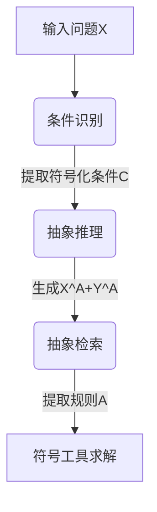

```markdown
# 增强大语言模型推理能力：如何通过强化抽象思维提升鲁棒性？  
——论文《Augmenting LLMs' Reasoning by Reinforcing Abstract Thinking》解读  

## 1. 研究背景与动机  
### 问题痛点  
- **分布偏移脆弱性**：现有大语言模型（如7B参数规模）在面临输入条件的数值变化、名称替换或干扰性条件插入时，推理性能显著下降。  
- **数据增强局限**：传统解决方案依赖生成大量合成数据，但计算成本高且泛化效果有限，无法从根本上提升模型提取抽象规则的能力。  

### 核心创新点  
研究团队提出**AbstraL框架**，通过以下突破解决上述问题：  
1. **符号化抽象优先**：直接学习问题背后的数学公式/逻辑规则等抽象表示，而非依赖具体实例数据。  
2. **神经-符号协同**：将自然语言问题分解为条件识别→抽象生成→符号化求解的模块化流程，兼容神经网络与方程求解器等符号工具。  

## 2. 方法详解：四步抽象推理框架  
### 关键技术流程  


#### 关键组件解析  
1. **条件识别**  
   - 将输入问题中的具体值（如"苹果12元"）映射为符号变量（`in0=12`）  
2. **抽象推理**  
   - 生成抽象问题X<sup>A</sup>（如"物品A价格in0元…"）及其符号化推导Y<sup>A</sup>  
3. **规则提取**  
   - 从Y<sup>A</sup>剥离具体上下文，提取纯抽象规则（如`<<in0+in1=out0>>`）  

### 强化学习设计亮点  
- **双奖励机制**：  
  - **答案正确性奖励**：验证抽象规则能否通过符号工具导出正确答案  
  - **符号距离奖励**：计算生成规则与黄金规则的编辑距离相似度  
  $$  
  r_{symbolic} = r_{max} \cdot \left(1 - \frac{\text{EditDistance}(\widetilde{A}, A)}{\max \text{Len}(a)}\right)  
  $$  
- **GRPO优化算法**：通过组归一化优势更新策略，避免传统PPO对奖励模型的依赖  

## 3. 实验与结果  
### 测试基准  
| 数据集        | 挑战类型                  | 性能提升 |  
|---------------|--------------------------|----------|  
| GSM-Symbolic  | 数值/变量名替换          | +15.2%   |  
| GSM-Plus      | 干扰条件插入             | Δ仅-1.27%|  

### 关键发现  
1. **小模型显著受益**：7B模型在符号化测试集上性能接近70B基线  
2. **抗干扰能力强**：面对无关条件插入时，性能下降幅度比基线低63%  
3. **计算效率优势**：相比数据增强方法，训练所需样本量减少80%  

## 4. 亮点与不足  
### 三大创新价值  
1. **抽象-实例解耦**：首次实现LLM推理过程中抽象规则与具体数据的显式分离  
2. **细粒度强化学习**：GranulAR数据集提供原子级抽象推理链标注  
3. **模块化设计**：条件识别、规则生成等组件可单独替换升级  

### 现存局限性  
- **领域受限**：当前仅验证数学推理任务，逻辑/常识推理效果待验证  
- **符号化瓶颈**：复杂语义（如比喻语言）难以转化为符号规则  
- **数据生成成本**：依赖70B大模型生成训练数据  

## 5. 启示与展望  
### 行业影响  
该方法为资源受限场景提供新思路：  
- 医疗领域：将临床指南转化为符号规则，提升小模型诊断可靠性  
- 金融领域：实现财报分析中的数值推理与变量泛化  

### 未来方向  
1. 扩展至程序合成等非数学任务  
2. 开发轻量级抽象规则蒸馏方案  
3. 设计语义敏感的符号距离度量  

> 论文代码已开源：https://github.com/AbstraL-project  
```