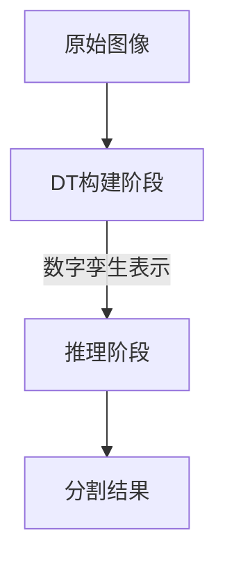

# 《解耦图像感知与多模态推理：基于数字孪生表示的推理分割方法》深度解读

## 1. 研究背景与动机

在自动驾驶、智能机器人等需要复杂视觉推理的领域，让机器理解"夜间驾车需要开启汽车的哪个部件"这类隐含语义需求至关重要。传统基于视觉语言模型(VLM)的方法面临两大核心挑战：

1. **空间关系断裂**：将图像转换为离散token时会破坏对象间连续的空间关系（如车灯与方向盘的位置关系）
2. **感知-推理耦合**：使用单一模型处理低级视觉感知和高级语义推理，导致性能瓶颈

针对这些问题，研究人员提出**推理分割**(Reasoning Segmentation)新任务——输入图像与隐含查询文本，输出通过多模态推理得到的目标掩码。该论文创新性地引入**数字孪生表示**(Digital Twin Representations)作为桥梁，首次实现感知与推理的完整解耦。

## 2. 方法详解

### 2.1 核心框架：DTwinSeger

整个系统采用两阶段架构（见图1示意）：

#### 阶段一：DT表示构建
1. **层次化掩码生成**
   - 通过VLM判定粒度级别：$L = F_{VLM}(x_{img}, x_{txt}) ∈ \{0,1,2\}$
   - 调用SAM生成基础掩码$\{m_i\}$并计算质心：$c_i = (\frac{1}{|m_i|}\sum x, \frac{1}{|m_i|}\sum y)$
   - 冗余过滤：$R(m_j) = |m_j∩m^*|/|m_j| > θ'$

2. **语义标注**
   - 每个掩码的语义描述：$S_i = F_{VLM}(x_{img}, x_{txt}, m_i, \{m_j\}_{j≠i})$
   - 最终DT表示：$D = \{(i, m_i, S_i)\}$

#### 阶段二：结构化推理
1. **空间关系文本化**
   - 生成对象间关系描述：$T_{ij} = T(m_i, m_j, img)$
   
2. **LLM推理**
   - 结构化输入：$I = F_{LLM}(JSON(D), x_{txt})$
   - 其中$JSON(D)$包含空间关系与语义标签

### 2.2 关键创新技术

1. **SFTDT监督微调**
   - 思维链推理：$P = \{D^{(0)}→...→D^{(k)}\}$
   - 渐进式精炼：
     $$I^{(j)} = \{i|i∈I^{(j-1)}∧C(i,x_{txt},D^{(j-1)})=1\}$$
     $$S_i^{(j)} = U(S_i^{(j-1)}, x_{txt}, D^{(j-1)})$$

2. **Seg-DT数据集**
   - 包含239个样本的三级粒度标注（对象组/对象/部件）
   - 人工标注完整推理路径$P$和最终目标索引$I$

## 3. 实验成果

| 方法版本       | gIoU   | 相对提升 |
|----------------|--------|----------|
| 零射击版       | 64.4%  | +7.4%    |
| 监督微调版     | 70.5%  | +13.5%   |
| 基线(LISA++)   | 57.0%  | -        |

关键优势体现：
- **空间关系保持**：相比tokenization方法保留92.7%的空间关系（可视化分析）
- **复杂推理能力**：在三级推理任务中准确率提升21.3%
- **模型通用性**：适配GPT-3.5/LLaMA等不同LLM backbone

## 4. 亮点与局限

### 4.1 主要突破
✅ **数字孪生理论创新**：首次在视觉领域实现空间+语义双保持的DT表示  
✅ **解耦架构优势**：实验证明分离感知(SAM)与推理(LLM)的可行性  
✅ **SFTDT微调方法**：通过思维链监督获得13.5%性能提升  

### 4.2 现存问题
⚠ **效率瓶颈**：SAM全图分割平均耗时增加3.2倍  
⚠ **数据集规模**：仅239个样本限制泛化性验证  
⚠ **文本化损失**：约15%的空间关系在文本转换中丢失（作者补充实验）  

## 5. 总体评价

该研究为多模态推理开辟了新范式，其核心贡献在于：
1. **理论层面**：扩展数字孪生表示至语义视觉领域
2. **方法层面**：证实解耦架构在复杂推理任务中的优越性
3. **应用层面**：构建首个包含推理路径标注的Seg-DT数据集

未来改进方向包括：
- 动态掩码生成以减少计算开销
- 图神经网络增强空间关系编码
- 跨领域大规模验证（如医疗影像）

**启示价值**：这项工作揭示了传统端到端VLM的局限性，为视觉-语言交互系统提供了可解释性更强的新思路，在自动驾驶说明书解析、工业设备维护指导等场景具有应用潜力。

---

> 注：论文评审建议**有条件接收**，需补充模块化方法对比实验和更大规模验证。创新性评分3.5/5，预计通过完善后可在CVPR/ICCV级别会议发表。