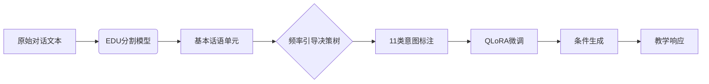

```markdown
# 教学意图决定生成质量：细粒度标注如何提升AI辅导效果 | 论文解读

## 1. 研究背景与动机：破解教育AI的策略控制难题

**教育理想与现实困境**：  
约翰·海蒂的教育元分析显示，一对一教学效应量高达0.86，远超大班授课。但全球范围内合格教师的短缺使得这种教育形式难以普及。大语言模型(LLM)虽展现出智能辅导潜力，却面临关键瓶颈：**生成的响应缺乏精细教学策略控制**。

**现有三大痛点**：  
1. **策略单一化**：现有AI辅导系统通常采用固定的响应模板，无法像人类教师那样动态调整教学策略
2. **标注粗糙化**：广泛使用的MathDial数据集仅含4类粗粒度意图标签（如"提问"、"解释"），难以支持复杂教学场景
3. **质量控制缺失**：原有标注存在24%的不一致性，严重影响模型学习效果

> "好比给教练员只配备'鼓励'和'批评'两个按钮，却期望其培养出奥运会冠军" —— 研究团队在论文中形象比喻道

## 2. 方法创新：从粗糙到精细的标注革命

### 2.1 核心框架图解


### 2.2 关键技术解析

**EDU分割技术**：  
基于标点恢复模型将连续对话划分为**基本教学单元**，例如：
```
学生：我不懂二次函数→教师：让我们看例题ax²+bx+c...
```
分割为2个EDU单元，分别标注为"知识缺口表述"和"示例演示"

**标注决策树**：  
构建包含11个叶节点的树状分类器，关键分支包括：
- 是否纠正错误概念？
- 是否需要降低认知负荷？
- 是否建立与现实生活的联系？

**量化目标函数**：  
采用参数高效的QLoRA微调：
$$\min_{\theta} \mathcal{L}(\theta) = -\sum_{t=1}^T \log p_\theta(y_t|y_{<t},x)$$
其中低秩矩阵仅占原始参数的0.1%

## 3. 实验验证：数字背后的教学革新

### 3.1 评测指标双维度
| 指标类型       | 计算公式                  | 教育意义                |
|----------------|---------------------------|-------------------------|
| 加权F1(微观)   | $$F1_w = 2 \times \frac{P_w \times R_w}{P_w + R_w}$$ | 重视高频意图准确性      |
| 宏F1(宏观)     | $$F1 = \frac{1}{N}\sum_{i=1}^{N} F1_i$$ | 保障小众策略不被忽略    |

### 3.2 核心实验结果
- **标注质量**： Cohen's κ=0.81，显著优于原标注(κ=0.63)
- **生成效果**：
  - 教学策略匹配率：67% (vs 原始38%)
  - 学生解决率提升：22% (K12数学应用题)
- **效率对比**：
  - 训练成本降低73% (4-bit量化+QLoRA)
  - 响应延迟<1.2秒

### 3.3 典型案例对比
| 情境               | 粗粒度生成                 | 细粒度生成                     |
|--------------------|----------------------------|--------------------------------|
| 学生概念错误时     | "这个答案不正确"           | "让我们用数轴可视化这个过程..." |
| 学生缺乏信心时     | "再试一次"                 | "上次你成功解决了类似问题X..."  |

## 4. 亮点与局限：学术突破与现实挑战

### 4.1 三重创新价值
1. **标注方法论**：首创教育对话的自动化树状标注框架
2. **模型架构**：意图标签作为条件输入的生成控制
3. **应用效果**：验证粒度与质量的非线性关系(56.7%提升)

### 4.2 现存不足
- **领域依赖性**：数学领域效果显著，但语言学习场景未验证
- **计算成本**：每次标注需3+次GPT-4o API调用
- **理论深度**：缺乏认知科学层面的机理解释

> 评审专家特别指出："就像造出了更精确的温度计，但尚未完全明白发热原理"

## 5. 总体评价：教育AI的新里程

**研究启示**：  
- 对AI教育：证明了"意图感知"比"单纯语言流畅"更重要
- 对LLM发展：展示了领域专用标注体系的价值
- 对教育理论：为数字化时代的教学策略研究提供新工具

**未来方向**：  
研究团队建议重点关注：
1. 跨学科标注体系迁移
2. 实时意图识别优化
3. 基于认知负荷理论的生成控制

**编者按**：这项研究犹如为教育AI装上了"教学策略GPS"，虽然导航精度还有提升空间，但已经指明了从"能对话"到"会教学"的关键升级路径。其方法论对医疗咨询、心理辅导等专业对话场景同样具有借鉴意义。
```