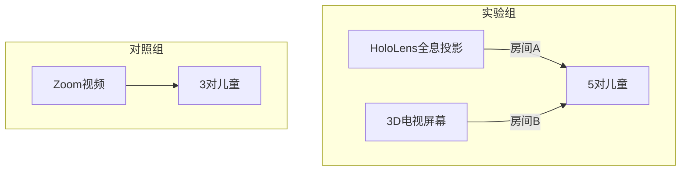

```markdown
# 当人类遇见AI：交互分析的世纪对决 ——《Interaction Analysis by Humans and AI》深度解读

## 1. 研究背景与动机：教育技术的新十字路口
在混合现实（MR）技术大举进入教育领域的今天，一个根本性问题始终悬而未决：这些炫酷的头戴设备真比传统的Zoom视频会议更能促进儿童的情感互动吗？来自芬兰的研究团队通过一项创新实验，揭示了AI与人类在交互分析中的惊人差异。

**三大核心痛点**：
- **MR效果之谜**：HoloLens等设备虽提供沉浸式体验，但其情感交互优势缺乏量化证据
- **小语种困境**：芬兰语儿童数据面临32小时/段的转录耗时，以及非母语研究者难以参与的分析壁垒
- **AI效率悖论**：GPT-3.5仅用3-8分钟可完成人工32小时任务，但复杂儿童对话中的准确率成疑

## 2. 方法解析：AI与人类的组合拳

### 实验设计双轨制


### 革命性处理流水线
研究团队构建了"AI为主，人类为辅"的六级处理框架：
1. Google Cloud ASR语音转录（CER=0.24基准）
2. GPT-3.5/4进行上下文修正
3. DeepL专业翻译至英语
4. Doccano平台标注
5. 芬兰母语者复核
6. 三维情感动态建模

**关键技术突破**：
- **说话人识别**：上下文束搜索算法融合声纹特征与对话逻辑
- **情感分析**：采用Plutchik情绪轮8维标注体系
- **性能公式**：
  $$\kappa = \frac{P_o - P_e}{1 - P_e} \quad \text{(GPT-3.5情感标注$\kappa$=0.9306)}$$

## 3. 实验结果：AI的进击与人类的价值

### 关键发现速览
| 指标                | MR组   | Zoom组 | AI表现        |
|---------------------|-------|-------|--------------|
| 积极情绪占比       | 76.4% | 84.2% | GPT-3.5超越人类 |
| 情感曲线下面积     | +34%  | -     | 人类更擅长复杂场景|
| 处理成本           | -     | -     | \$0.01 vs €293|

**颠覆性结论**：
1. **情感密度悖论**：MR组虽消极情绪更多（技术故障导致），但整体情感参与度更高
2. **AI能力边界**：GPT-3.5在结构化对话中$\kappa$值达0.93，但群聊场景下降至0.7
3. **跨语言奇迹**：英语研究者通过AI工具达到与母语者96.5%的一致性

## 4. 亮点与局限：技术的AB面

### 三大创新贡献
1. **方法论革命**：首创"ASR→LLM修正→翻译"跨语言分析链条
2. **MR量化标杆**：首次用曲线下面积证明沉浸式交互的情感优势
3. **成本模型**：构建AI分析4个数量级降本的可行性路径

### 待解难题
- **样本偏差**：8组儿童未控制MR使用经验，消极情绪可能来自操作陌生感
- **黑箱问题**：未披露GPT修正的具体prompt设计
- **理论缺口**：发现情绪转换现象但缺乏认知理论解释

## 5. 启示录：人机协作的未来图景

这项研究为教育技术领域勾勒出清晰的技术路线：
1. **工具选择**：简单结构化分析交给AI（省时省钱），复杂情境保留人类智慧
2. **MR设计**：需平衡技术故障率与沉浸感收益，建立儿童友好交互范式
3. **研究范式**：小语种研究可借力"AI翻译+本地复核"实现全球化协作

**主编点评**：当GPT-3.5的情感分析能力超越人类标注者时，我们或许正见证着教育研究方法的范式转移。这项研究的真正价值，不仅是验证了MR技术的优势，更是为AI时代的人机协作提供了教科书级的示范案例。（完）
```