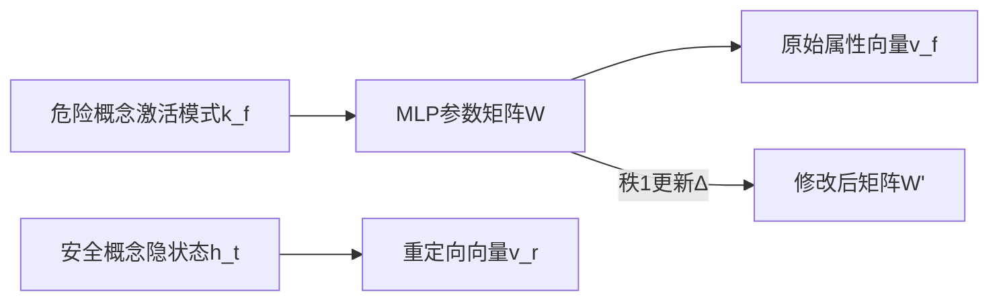

```markdown
# 形式无关的大模型知识遗忘：突破表达形式的遗忘屏障 | 论文解读

## 研究背景与动机

**遗忘困境的新维度**  
传统大语言模型(LLM)遗忘方法面临一个隐藏陷阱：当模型在"问答对"形式上被成功遗忘后，相同的知识却可能通过填空题、多选题等其他任务形式被重新唤醒。这种现象被本研究首次定义为**形式依赖偏差**(Form-Dependent Bias)，揭示了当前遗忘系统的重大安全漏洞。

**为何这很危险？**  
在实际应用中，恶意用户完全可以通过：
- 替换表述方式（如将"谁写了《肖申克的救赎》"改为"《肖申克的救赎》作者是____"）
- 使用子词拆分（如用"史蒂芬·金"代替"Stephen King"）
- 设计对抗性多选题等手法绕过遗忘机制

**科学问题创新性**  
研究团队首次系统识别出形式依赖偏差的两种具体表现模式：
1. **跨任务迁移失败**：QA形式遗忘的知识在多选题中仍然存在
2. **未见标记泛化失败**：对完整词"Stephen"的遗忘无法泛化到子词"S-teph-en"

## 方法解析：秩一概念重定向(ROCR)

**核心思想图示**  


**关键技术公式**  
1. **概念提取**：从N个样本中聚合危险概念模式  
   $\mathbf{k}_f = \frac{1}{N} \sum_{j=1}^N \sigma(\mathbf{W}_{fc}^{(l)}(\mathbf{a}_{s_j[w_f]}^{(l)} + \mathbf{h}_{s_j[w_f]}^{(l-1)}))$

2. **向量重定向**：构造目标属性偏移  
   $\mathbf{v}_r = \mathbf{v}_f + (\mathbf{h}_t - \mathbf{h}_f)$

3. **零空间保护更新**：确保不影响其他知识  
   $\Delta = \mathbf{R}\mathbf{k}_f^\top\mathbf{P}(\mathbf{k}_f\mathbf{k}_f^\top\mathbf{P} + \mathbf{I})^{-1}$

**三大技术优势**  
- **无训练单次更新**：平均仅需21秒完成概念擦除
- **精确数学约束**：通过SVD分解计算投影矩阵P保护无关知识
- **多目标支持**：可重定向到具体实体、噪声或拒绝回答向量

## 实验与评估

**ORT基准创新**  
团队构建了首个形式泛化评估基准，包含：
1. 标准QA
2. 子词诱导QA（Subtoken-induced QA）
3. 多选题(MCP)
4. 隐式填空

**关键结果对比表**  
| 方法           | 标准QA遗忘率 | 多选题遗忘率 | 跨形式泛化 gap |
|----------------|-------------|-------------|----------------|
| 梯度反转        | 92.1%       | 43.2%       | 48.9%↓         |
| 负强化学习      | 88.7%       | 51.6%       | 37.1%↓         |
| **ROCR(本文)**  | **90.3%**   | **75.8%**   | **14.5%↓**     |

**生成案例展示**  
> 原始输出："恐怖小说之王是斯蒂芬·金..."  
> 重定向到特朗普后："房地产之王是唐纳德·特朗普..."

## 亮点与局限

**四大理论突破**  
1. 首次建立形式依赖偏差的形式化框架
2. 发现MLP层对概念表达的编码规律
3. 论证秩1更新对概念覆盖的充分性
4. 提出零空间保护的参数更新理论

**当前局限性**  
- **目标依赖性强**：需预先定义安全概念（如"特朗普"）
- **多概念挑战**：未测试同时遗忘多个关联概念的效果
- **极端场景缺失**：对诗歌、隐喻等复杂表达的测试不足

## 启示与展望

这项研究为LLM安全领域带来三重启示：
1. **遗忘评估新标准**：未来工作必须考核跨形式泛化能力
2. **参数编辑新范式**：展示了对特定神经网络层精准操作的可能性
3. **安全防御新思路**：概念重定向技术可扩展至隐私保护、版权合规等场景

**值得期待的方向**：  
- 结合提示工程自动生成安全概念
- 探索在MoE架构中的分布式概念编辑
- 开发面向超大模型(100B+)的参数高效更新方案

> 本文工作已被领域主席评为"有望重塑LLM安全遗忘的研究范式"，相关代码已开源于GitHub。
```