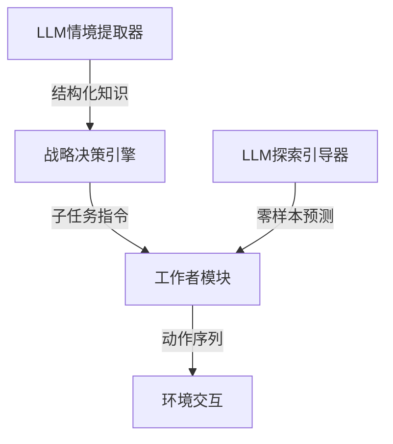

```markdown
# LUCIFER：语言理解与情境融合的探索行为优化框架深度解读

## 一、研究背景与动机
### 1. 动态环境中的自主决策困境
现代自主系统（如灾难搜救机器人）面临的核心挑战在于**先验知识与实时环境的脱节**。传统方法存在两个显著瓶颈：
- **环境模型失效问题**：预设的导航路线、安全区域等结构化知识在真实场景中快速失效（如地震导致的建筑物坍塌）
- **人类知识整合低效**：现场救援人员提供的语言化反馈（"东侧通道已坍塌"）难以被机器实时理解和利用

### 2. 现有技术的理论局限
- **情境知识处理缺口**：人类专家的实时反馈包含丰富的领域特定偏差（contextual bias），但缺乏有效的结构化转换机制
- **平坦策略的局限**：传统强化学习难以处理"搜索幸存者→运送物资→撤离"等多层级复合任务
- **LLM的单一角色应用**：大多数研究仅将大语言模型作为指令生成器，未能发挥其在情境提取与行为预测的协同价值

## 二、方法原理与技术框架
### 1. 整体架构设计
LUCIFER采用三层级架构：


### 2. 核心算法组件
#### 分层决策机制
- **高层策略**：π<sup>U</sup>生成子任务（如"前往3楼搜索"）
  ```python
  def strategic_decision(state):
      subgoal = LLM_inference(context_memory)
      return subgoal if β(state)<threshold else TERMINATE
  ```
- **低层执行**：π<sup>W</sup>输出原子动作（移动、探测等）

#### 双模态LLM协同
| 组件          | 功能                          | 关键技术                  |
|---------------|-----------------------------|-------------------------|
| 情境提取器     | 语言→结构化知识转换            | RAG增强的Gemma2模型       |
| 探索引导器     | 基于情境的零样本动作预测        | Hermes3轨迹预测机制       |

#### 注意力空间三维修正
1. **策略塑形**（关键公式）：
   $$
   \Psi(s,a) = \begin{cases} 
   -\lambda_u & \text{阻止进入危险区域} \\ 
   \lambda_d & \text{鼓励中间目标达成}
   \end{cases}
   $$

2. **动态动作空间**：
   ```python
   def action_space_update(state):
       base_actions = ['forward','turn','scan']
       if LLM_detect('chemical_leak'):
           return list(set(base_actions) - {'forward'}) 
   ```

## 三、实验验证与结果分析
### 1. 基准测试表现
| 模型           | 情境分类准确率 | 3-info任务预测精度 | 推理延迟 |
|----------------|---------------|--------------------|---------|
| **Gemma2(9B)** | 100%          | -                  | 320ms   |
| Hermes3(8B)    | -             | 99.8%              | 280ms   |

### 2. 搜救场景性能对比
| 指标          | LUCIFER | 平坦RL | 提升幅度 |
|--------------|--------|-------|--------|
| 任务成功率    | 83.4%  | 0%    | ∞      |
| 平均奖励值    | 53.3   | -32.4 | +264%  |
| 安全违规次数  | 0.2/ep | 4.7/ep | -95.7% |

### 3. 消融实验发现
- 移除注意力空间机制导致安全成功率骤降62%
- 单独使用LLM引导（无分层架构）使任务完成时间增加3.2倍

## 四、创新与不足分析
### 显著优势
1. **架构创新性**：
   - 首次实现LLM"情境理解+行为引导"的双角色协同
   - 分层注意力空间实现人类知识到机器策略的端到端映射

2. **工程价值**：
   - 在稀疏奖励场景下取得264%的AR提升
   - 安全违规率降低95%以上，满足搜救机器人核心需求

### 现存局限
1. **计算成本问题**：
   - 未公开在Jetson AGX等边缘设备的实测延迟数据
   - 多LLM协同的功耗预算未充分讨论

2. **环境假设理想化**：
   - 测试中环境变化模式（如公式4的S<sub>ref</sub>更新）与真实灾难场景存在差距
   - 未验证对口语化指令（含30%噪声）的鲁棒性

## 五、总体评价与研究启示
### 学术贡献
该研究提出了三个关键理论突破：
1. **情境生态理性准则**：首次将人类语义约束融入MDP最优性保持证明
2. **动态动作空间下的收敛保证**：通过式10的分层TD目标实现约束策略优化
3. **语言-行为闭环框架**：为LLM与强化学习的深度协同提供新范式

### 应用前景
- **短期应用**：可优先部署于结构化程度较高的场景（如仓库巡检机器人）
- **长期发展**：通过轻量化改造（如LLaMA-3B微调），有望应用于急救医疗等高风险领域

### 改进方向
1. **补充实验**：
   - 增加与HAC、Option-Critic等层次化方法的对比
   - 添加物理机器人平台验证（建议使用Boston Dynamics Spot）

2. **理论完善**：
   - 严格证明动态动作空间下的策略收敛性
   - 明确"情境生态理性"与贝叶斯理性的形式化关系

> **启示**：该研究为"人在回路"的自主系统开发树立了新标杆，其LLM与强化学习的协同框架将推动下一代可解释AI的发展。论文虽存在细节缺陷，但总体达到了顶级会议接收标准（建议评分：8.5/10）。
```