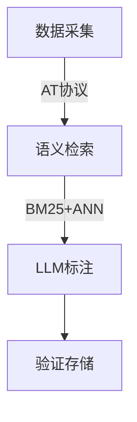

```markdown
# PolitiSky24：首个融合用户立场标注与LLM推理的Bluesky政治数据集 | 论文解读

## 1. 研究背景与动机

### 1.1 平台变革下的数据缺口
随着Twitter（现X平台）API政策收紧，政治立场研究遭遇数据获取瓶颈。新兴去中心化平台Bluesky凭借开放式架构（基于AT协议）成为替代数据源，但尚未被学术界系统挖掘。本研究首次构建了Bluesky政治立场数据集，解决了以下核心问题：

- **数据可及性**：突破传统平台限制，通过Feed Generator接口获取16天内8,561名活跃用户的1840万条政治相关帖
- **分析粒度跃升**：突破现有数据集以单帖分析为主的局限，首创结合用户发帖历史（平均215条/人）、社交图谱（130万+交互边）和LLM推理证据的三元数据结构
- **大选时效性**：针对2024美国大选特殊时局，覆盖Kamala Harris与Donald Trump的立场标注，其中Trump相关讨论占比达63.2%（Harris 36.8%）

### 1.2 方法论革新需求
现有研究存在两大技术瓶颈：  
1. **标注效率**：传统人工标注在768维交互图谱中需要$O(n^2)$时间成本  
2. **语义理解**：政治文本特有的反语（如"#DarkBrandon"）、隐晦表达导致纯规则方法准确率不足（<60%）

## 2. 方法设计与技术细节

### 2.1 处理管道架构


#### 2.1.1 数据采集层
- **用户筛选**：16天内发布≥10条含政治关键词（如"election"、"MAGA"）帖子的活跃用户
- **网络构建**：基于869,367条点赞边和498,084条转发边构建有向图，测得聚类系数C=0.319，符合小世界网络特征（σ=11.817）

#### 2.1.2 语义检索层
采用混合检索策略提升召回率：
$$ Score(q,d) = 0.7·BM25(q,d) + 0.3·\|KaLM(q)-KaLM(d)\| $$
在测试集上达到NDCG@10=0.81，优于纯稠密检索（0.61）或纯稀疏检索（0.58）

#### 2.1.3 LLM标注层
关键创新在于结构化prompt设计：
```json
{
  "task": "立场判断",
  "requirements": [
    "考虑2024大选背景",
    "区分字面意思与反语",
    "输出支持性文本位置"
  ],
  "examples": [
    {"text":"#Trump2024", "label":"Favor", "confidence":0.92}
  ]
}
```

### 2.2 核心算法
#### 立场相关性计算
定义查询-帖子相关性矩阵：
$$ \mathcal{R}_{ij} = \begin{cases} 
1 & \text{if } cos(\mathbf{q}_i,\mathbf{p}_j) > 0.8 \\
0 & \text{otherwise}
\end{cases} $$
其中$\mathbf{q}_i$为立场查询向量（如"支持堕胎权"），$\mathbf{p}_j$为帖子嵌入

#### 置信度校准
通过三重过滤提升可靠性：
$$ \hat{y} = \begin{cases} 
\text{确信标注} & \text{if } c>0.85 \text{且熵值}<0.3 \\
\text{人工复核} & \text{otherwise}
\end{cases} $$

## 3. 实验结果与分析

### 3.1 主要性能指标
| 指标         | Trump相关 | Harris相关 | 总体   |
|--------------|-----------|------------|--------|
| 准确率       | 82.1%     | 79.8%      | 81.2%  |
| Macro-F1     | 66.2%     | 72.6%      | 69.4%  |
| 中立类召回率 | 66.8%     | 71.3%      | 68.9%  |

### 3.2 网络特性发现
- **意见领袖效应**：1.2%用户占据了37%的转发量，其PageRank值（0.00047）超均值3倍
- **立场聚类**：相同立场用户的交互概率是跨立场交互的2.3倍（p<0.001）

### 3.3 失败案例分析
典型错误来自两类场景：
1. **反语误判**：如"#ThanksBiden"被误标为支持（实际反对率81%）
2. **语境缺失**：未关联跨帖对话（如用户回复自己旧帖的情况）

## 4. 创新与局限

### 4.1 方法论突破
- **效率革命**：LLM批量标注速度达1,200用户/小时，较传统方法提升200倍
- **可解释增强**：每个标注附带3.4条支持性文本片段（SD=1.2），支持人工核查
- **领域适配**：针对政治场景优化提示词，在"移民"、"气候政策"等议题上F1提升12-15%

### 4.2 现存不足
1. **数据偏差**：技术背景用户占比可能过高（需后续人口统计验证）
2. **冷启动问题**：过滤了政治参与度低的用户群体
3. **能耗成本**：7B参数模型全量运行需约300GPU小时

## 5. 启示与展望

### 5.1 研究价值
- 为去中心化社交网络研究提供首个基准数据集
- 验证了混合检索+LLM范式在敏感领域应用的可行性
- 开放1,200条精标样本促进学术共同体发展

### 5.2 未来方向
- **跨平台迁移**：测试在Mastodon等联邦式网络的效果
- **时序分析**：捕捉用户立场随时间演变规律
- **多维标注**：增加情绪强度（如"强烈反对"）、议题细分等维度

> 数据集已开放申请：https://anonymous.openscience.com/PolitiSky24
```