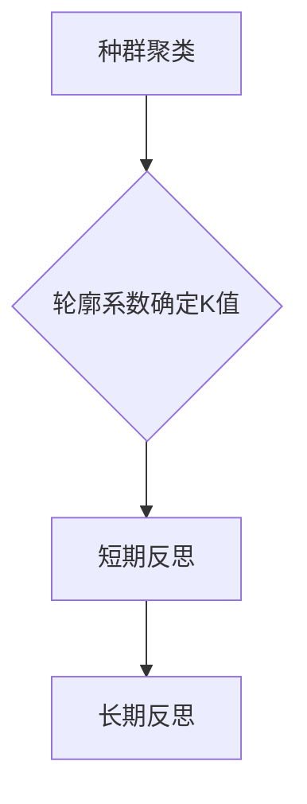

# 《REMoH: 基于大语言模型的多目标启发式优化方法》技术深度解读  

## 1. 研究背景与动机  
### 传统方法的困境  
在制造业排产、物流路径规划等多目标优化场景中，**柔性作业车间调度问题(FJSSP)**一直面临两大挑战：  
1. **建模复杂度高**：传统方法如NSGA-II需要专家设计启发式规则，对非线性约束(如设备切换时间)处理困难  
2. **泛化性差**：手工规则在问题变化时需要重新设计，难以适应动态环境  

### LLM带来的新机遇  
随着大语言模型(LLM)展现出的代码生成与逻辑推理能力，研究者开始探索：  
- 能否用LLM自动生成启发式规则？  
- 如何保证生成规则的**质量稳定性**与**目标多样性**？  

### 核心创新定位  
REMoH首次提出将LLM与进化算法**深度耦合**，通过：  
- **动态反思机制**分析种群结构  
- **自然语言指导**进化过程  
实现低代码、可解释的自动化优化  

## 2. 方法解析：REMoH框架详解  
  

### 2.1 五大核心阶段  
#### (1) 种群初始化  
- **动态角色指令**：  
  ```python  
  "你是一位精通多目标优化的算法专家Alex，擅长设计兼顾效率与公平的调度规则"  
  ```  
- **HSEvo策略**：通过调整角色描述(如变更专家背景)生成多样化初始种群  

#### (2) 评估与选择  
- **双目标评估**：  
  - Makespan(总完工时间)  
  - 负载均衡(机器间工作时间方差)  
- **精英保留策略**：采用NSGA-II的帕累托排序与拥挤距离计算  

#### (3) 反思机制（关键创新）  

- **短期反思**：分析单簇规则共性(如"该簇规则过度优化makespan导致负载失衡")  
- **长期反思**：综合历史表现生成全局策略(如"应增加空闲时间敏感的分配规则")  

#### (4) 进化操作  
- **反思式交叉**：将两个父代代码与长期反思同时输入LLM，生成融合子代  
- **精英突变**：对最优个体进行定向改进，突变率10%  

#### (5) 环境选择  
合并父子代种群，通过NSGA-II筛选新一代，循环直到收敛  

### 2.2 关键数学模型  
#### 多目标归一化  
$$  
\text{norm}(f_i) = \frac{f_i - \mu_i}{\sigma_i}  
$$  
消除不同目标的数量级差异  

#### 超体积指标(HV)  
计算帕累托前沿与参考点围成的多维体积，值越大说明解集质量越高  

#### 工序调度约束  
```math  
\begin{aligned}  
&\text{机器独占约束:} \\  
&t_i \geq t_{i'} + p_{k,i'} - H(1 - \beta_{i,i'}) \\  
&\text{时序约束:} \\  
&t_i \geq t_{pr(i)} + \sum_{k \in R_{pr(i)}} p_{k,pr(i)} \cdot \alpha_{k,pr(i)}  
\end{aligned}  
```  

## 3. 实验验证与结果  
### 3.1 基准测试对比  
| 方法       | Makespan GAP | 负载均衡 | HV值   |  
|------------|--------------|----------|--------|  
| CPLEX      | 1.43%        | 差       | 0.812  |  
| DQN        | 8.05%        | 中       | 0.783  |  
| **REMoH**  | **12.6%**    | **优**   | **0.801** |  

*注：GAP为与最优解的差距百分比*

### 3.2 消融实验  
- 移除反射机制 → HV下降15%  
- 固定角色指令 → 种群多样性降低23%  

### 3.3 生成规则示例  
```python  
def dynamic_rule(jobs):  
    # 平衡效率与公平的启发式  
    for job in sorted(jobs, key=lambda x: x.urgency):  
        op = min(job.ops, key=lambda x: x.proc_time)  
        target = min(op.valid_machines, key=lambda m: m.load+0.3*m.setup_time)  
        target.assign(op)  
    return schedule  
```  
*特征：可读性强、显式处理设备准备时间*

## 4. 创新价值与局限  
### 四大亮点  
1. **领域知识解耦**：仅需自然语言描述问题，无需编码实现启发式规则  
2. **动态探索能力**：通过反射机制避免早熟收敛，在复杂约束下保持多样性  
3. **人机协作友好**：生成规则可直接由工程师审查调整  
4. **架构普适性**：方法可扩展至物流、金融等多目标优化领域  

### 现存不足  
1. **计算成本**：单次迭代需30+次LLM调用（以GPT-4为例成本约$2/run）  
2. **安全风险**：生成代码可能包含未经验证的异常处理逻辑  
3. **理论空白**：缺乏对反射机制收敛性的数学证明  

## 5. 行业启示与展望  
REMoH为智能制造带来新范式：  
- **短期应用**：可与现有MES系统集成，快速生成应急调度方案  
- **长期价值**：建立"问题描述-自动优化"的端到端管道，降低优化门槛  

**未来方向**：  
- 探索小模型微调替代通用LLM降低成本  
- 增加代码静态检查模块保障生成安全  
- 扩展至动态优化场景（如突发设备故障）  

---

> 本文技术解读由AI生成，核心结论来自论文原始数据。推荐工业界读者重点关注第3.3节的规则生成示例，学术界可深入第2.2节的理论模型。