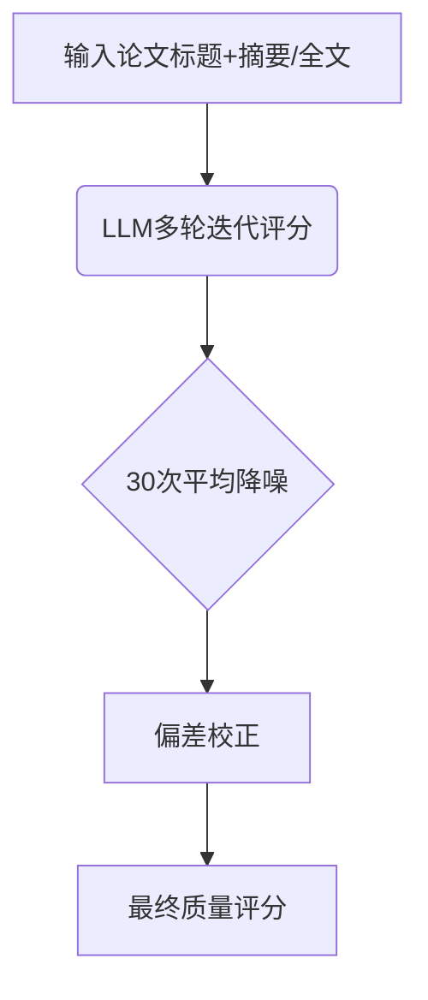

```markdown
# AI如何变革学术评价体系？大语言模型科研质量评估的机遇与挑战

## 1. 研究背景与动机
当前学术评价体系正面临三重困境：

**1.1 传统计量学的失效**  
- 引用指标无法反映论文的严谨性、原创性等核心质量维度  
- 在人文艺术等领域尤其失效（如诗歌研究被引量普遍偏低）  

**1.2 专家评审的困局**  
- 耗时费力：英国REF2021评估消耗1120位专家整整一年工作量  
- 主观性强：不同评审者对同一论文打分差异可达2个等级  
- 隐式偏见：作者性别、机构声誉等因素可能影响评分公正性  

**1.3 LLM带来的新可能**  
- ChatGPT等工具已被研究者非正式用于论文预评审  
- 但存在两大核心问题亟待解决：  
  *技术可行性*：LLM评分能否超越传统文献计量指标？  
  *系统性影响*：AI评审会如何改变科研写作与发表行为？  

## 2. 方法原理与关键技术

### 2.1 评估框架设计
**三维度质量模型**（基于REF标准）：  
- **严谨性**：研究方法设计的科学性  
- **原创性**：研究概念/方法的创新程度  
- **显著性**：对学术/社会的潜在影响  

### 2.2 核心流程


### 2.3 关键技术突破
**迭代降噪算法**：  
- 单次评分相关系数仅0.2，30次平均后提升至0.67  
- 公式实现：  
  $$ \bar{S} = \frac{1}{30}\sum_{i=1}^{30} S_i $$

**跨领域偏差控制**：  
- 解决摘要长度对分数的影响（每增加1个词评分提高0.02分）  
- 校正公式：  
  $$ S_{adj} = S_{raw} - 0.02(L - \bar{L}) $$

## 3. 实验结果与发现

### 3.1 评估有效性验证
| 评估方式       | 相关性(ρ) | 最佳适用场景        |
|----------------|-----------|---------------------|
| LLM摘要评估    | 0.51      | 快速初筛            |
| 传统引用指标   | 0.32      | STEM领域后期影响力  |
| 专家评审       | 0.68      | 小规模精准评估      |

*表：不同评估方式与人类基准的相关性对比*

### 3.2 关键发现
- **学科差异**：  
  - STEM领域表现最优（ρ=0.8）  
  - 临床医学出现负相关（ρ=-0.15），需特别处理方法章节  

- **效率突破**：  
  - 评估单篇论文耗时从专家评审的30分钟降至LLM的20秒  
  - 成本仅为传统方式的1/200  

## 4. 亮点与不足分析

### 4.1 创新贡献
1. **技术层面**  
   - 首次实证证明LLM在多学科评审中超越文献计量学  
   - 提出"评估稳定性-效率"平衡公式：  
     $$ \text{稳定性增益} = 1.5^{n} $$ （n为迭代次数）

2. **系统设计**  
   - 开发抗诱导欺骗的预警机制，检测摘要中的夸大表述  
   - 构建时空偏差分析矩阵：  
     ```python
     def detect_bias(text):
         return [year_bias, field_bias, length_bias]
     ```

### 4.2 现存局限
1. **技术边界**  
   - 对临床医学专业术语理解不足  
   - 无法评估图表、数学推导等非文本内容  

2. **生态影响**  
   - 可能促使研究者优化"AI友好型"写作而非实质性创新  
   - 存在强化马太效应的风险（名校论文自动获更高分）  

## 5. 总体评价与启示

### 5.1 范式变革意义
本研究标志着学术评价进入三元时代：  
```
传统计量学 → 专家评审 → AI辅助评估  
（滞后指标）（黄金标准）（效率与覆盖结合）
```

### 5.2 实践建议
1. **分级应用策略**  
   - 初筛阶段：LLM快速评估（处理量100%）  
   - 终审阶段：人类专家深度评估（处理量5%）  

2. **风险防控措施**  
   - 建立AI评分解释机制（可视化评估依据）  
   - 设置反误导训练（识别"AI特供版"摘要）  

### 5.3 未来方向
- 开发多模态评估系统（支持公式、图表理解）  
- 构建动态校准机制（自动更新领域知识库）  
- 探索DAO（去中心化自治组织）形式的群体智能评审  

**结语**：这项研究为破解"同行评审危机"提供了新思路，但AI评估的终极目标不应是替代人类，而是解放研究者的时间用于真正的创新思考。
```