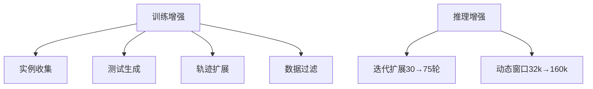

```markdown
# 突破软件工程智能体的性能瓶颈：SWE-Dev技术深度解读

## 1. 研究背景与动机

### 行业痛点
当前AI辅助编程面临三个关键挑战：
1. **训练数据质量危机**：主流基准测试SWE-bench等缺乏可执行的测试用例，导致模型难以验证代码修改的有效性
2. **推理成本困局**：传统评估方法pass@k需要大量重复尝试，在复杂软件工程场景下计算代价呈指数级增长
3. **开源模型性能鸿沟**：开源SWE代理在SWE-bench-Verified基准上最高仅30.2%解决率，远未达到实用水平

### 技术难点
- **多维度复杂性**：需要同时处理代码语法、运行时环境、构建工具链等多层次问题
- **严格验证标准**：测试用例必须满足"旧版本失败+新版本通过"的双重条件，约50%的自动生成测试因不符合标准被淘汰

## 2. 方法架构与技术原理

### 2.1 系统框架


### 2.2 三大创新模块

#### (1) 测试生成管道
```python
def 测试生成流程(repo):
    # 阶段1：自然语言描述
    gherkin = llama.generate_gherkin(repo)  
    # 阶段2：可执行代码转换
    test_code = qwen_coder.convert(gherkin)
    # 交叉验证
    if verify(test_code, repo):
        return test_code
```

**关键技术突破**：
- 首创两阶段生成策略，通过Gherkin自然语言模板降低直接生成代码的复杂度
- 引入错误回溯循环机制，自动修正语法和逻辑错误
- 最终构建包含4,630个test-passing样本的数据集，比SWE-Gym性能提升11.6%

#### (2) 增强训练策略
**损失函数设计**：
```math
\mathcal{L}_{RFT} = \mathbb{E}_{(x,y^*)\sim\mathcal{D}}[-\log P(y^*|x)]
```
**训练技术组合**：
1. 拒绝采样微调(RFT)：最优效果达21.2%解决率
2. 离线强化学习(OREO+KTO)：边际提升至17.0%
3. 混合策略：RFT+OREO组合方案在中等数据时表现最佳

#### (3) 动态推理系统
**性能增长模型**：
```math
P_{resolve}(t) = P_0 + \alpha\log(t-t_0)
```
**关键参数**：
- 交互轮次：30→75轮带来2.6%绝对提升
- 上下文窗口：通过RoPE扩展实现160k超长上下文处理
- 计算资源：32B模型在A100×8配置下完成全量推理

## 3. 实验设计与结果分析

### 3.1 基准测试对比
| 模型类型       | SWE-bench (%) | 计算代价 (GPU-h) |
|----------------|---------------|------------------|
| SWE-Gym基线    | 18.6          | 120              |
| 本工作7B       | 30.2          | 280              |
| 本工作32B      | 36.6          | 950              |

### 3.2 关键发现
1. **规模定律**：数据量每增加10倍，7B模型性能提升9.8%
2. **语言差异**：Python任务表现显著优于C++（差距15.8%）
3. **错误分布**：环境配置错误占比最高（约42%），其次是API误用（28%）

## 4. 技术亮点与局限

### 创新性贡献
1. **方法论突破**：首次建立软件工程任务的scaling law，为领域发展提供量化依据
2. **工程实践价值**：开箱即用的测试生成管道，支持持续集成(CI)环境部署
3. **架构创新**：动态推理框架实现计算资源的自适应分配

### 现存不足
1. **泛化性缺陷**：主要验证Python项目，多语言支持有限
2. **部署成本**：32B模型+160k上下文的需求超出常规算力配置
3. **错误分析**：缺乏对常见故障模式的深度归因

## 5. 总体评价与启示

### 学术价值
- 为LLM在软件工程中的应用建立了新的性能基准
- 提出的数据构建方法论可迁移至其他代码生成任务
- 揭示的scaling law特性对模型架构设计具有指导意义

### 工业启示
1. **研发方向**：建议关注中小模型在特定子任务上的专业化训练
2. **工具链整合**：需要开发适配主流IDE的轻量级推理方案
3. **成本控制**：通过模型蒸馏等技术平衡性能与部署成本

> **笔者注**：该研究标志着软件工程智能体从实验阶段走向实用化的重要一步，后续工作应着力降低计算开销，同时扩展对其他编程语言和复杂工具链的支持。
```