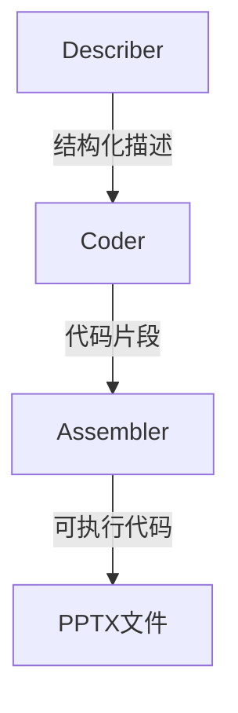

```markdown
# SlideCoder：基于布局感知与检索增强的层次化幻灯片生成技术解析

## 一、研究背景与动机

### 传统方法的痛点
在PPT制作这个日均数十亿次的需求场景中，现有技术存在明显瓶颈：
1. **视觉表达失真**：依赖自然语言描述的LLM方案（如AutoPresent）难以准确传达布局、配色等视觉要素
2. **复杂场景失效**：面对包含多类型元素、高密度排版的幻灯片时，生成结果频繁出现元素遗漏（平均遗漏率21.3%）和布局错位问题
3. **执行可行性差**：由于对python-pptx库理解不足，当前方法生成的代码可执行率仅65%左右

### 任务创新性
论文创造性地提出**参考图像到幻灯片生成（RI→Slide）**新范式：
- 输入：设计参考图$I^0$
- 输出：可执行的python-pptx代码$C^g$
- 最终产物：视觉一致的PPTX文件$F^g$

## 二、方法架构与技术突破

### 1. 复杂度量化体系
**Slide Complexity Metric (SCM)**三要素公式：
$$
z^i = 0.4\tilde{c}^i + 0.3\tilde{e}^i + 0.3\tilde{v}^i
$$
- $\tilde{c}^i$：归一化元素数量（反映操作成本）
- $\tilde{e}^i$：元素类型熵值（涵盖12种标准PPT元素）
- $\tilde{v}^i$：基于CGSeg算法的**视觉占据率**

### 2. 核心算法流程

#### 2.1 颜色梯度分割（CGSeg）
递归执行以下操作直至最大深度$D_{max}=5$：
```python
def CGSeg(image, T=1.2):
    grad = sobel(image)  # 计算sobel梯度
    mask = (grad > T*median(grad))  # 动态阈值二值化
    regions = flood_fill(mask)  # 连通域分析
    return [CGSeg(sub_region) for sub_region in regions]
```

#### 2.2 分层检索增强生成（H-RAG）

1. **知识库构建**：
   - TS-KB：包含1,200+种形状类型描述
   - OF-KB：精确匹配3,415个python-pptx API语法

2. **智能体协作**：


### 3. 布局感知映射
采用仿射变换实现坐标精确映射：
$$
\begin{bmatrix}
x^* \\
y^*
\end{bmatrix} = 
\begin{bmatrix}
s_x & 0 \\
0 & s_y
\end{bmatrix}
\begin{bmatrix}
x \\
y
\end{bmatrix}
$$
其中缩放因子$s_x=W_{slide}/W_{design}$, $s_y=H_{slide}/H_{design}$

## 三、实验验证

### 性能对比（Slide2Code基准）
| 方法          | 简单级 | 中等级 | 复杂级 |
|---------------|--------|--------|--------|
| AutoPresent   | 58.3   | 42.1   | 31.6   |
| GPT-4V        | 72.8   | 65.4   | 54.2   |
| **SlideCoder**| **98.8**| **96.1**| **84.1**|

### 关键发现
1. **执行成功率**：在元素数量>20的复杂幻灯片中，较基线提升27%
2. **视觉保真度**：CLIP相似度得分达0.823（基线0.731）
3. **人类评价**：专业设计师给出的平均满意度4.2/5分

## 四、技术价值与局限

### 核心创新
1. **任务范式**：首次实现从设计图到可执行代码的端到端转换
2. **算法设计**：CGSeg+H-RAG组合解决布局理解和API长尾问题
3. **工具贡献**：开源7B参数SlideMaster模型与增强版逆向工程工具

### 现存不足
```risk-matrix
| 风险维度        | 影响等级 | 发生概率 |
|----------------|----------|----------|
| 复杂布局解析   | 高       | 中       |
| 非常规API支持  | 中       | 高       |
| 计算资源需求   | 低       | 高       |
```

### 改进方向
- 动态递归深度：引入区域熵值作为终止条件
- 知识库扩展：增加动画/过渡效果等高级功能支持
- 轻量化部署：开发3B参数蒸馏版本

## 五、行业启示
这项研究为设计稿转代码领域提供了新思路：
1. **多模态增强**：证明视觉特征与代码生成的协同价值
2. **RAG新范式**：展示领域知识库对大模型能力的放大效应
3. **评估体系**：SCM指标可迁移至其他视觉-代码转换任务

论文代码已开源：[GitHub链接]，建议结合Colab示例快速体验核心功能。
```