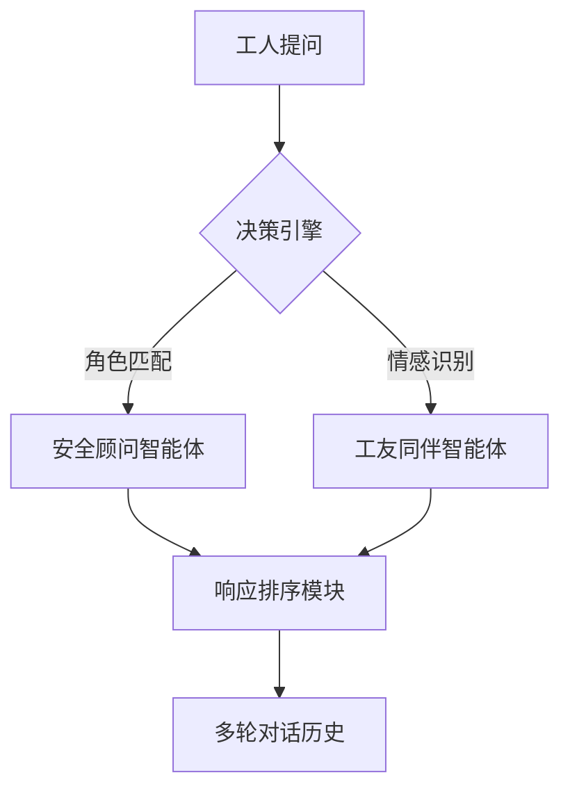

```markdown
# 建筑业工人心理健康的AI守护者：多智能体对话系统技术解析  
## ——《Supporting Construction Worker Well-Being with a Multi-Agent Conversational AI System》论文解读  

### 1. 研究背景与动机  
**行业危机**  
- **触目惊心的数字**：美国建筑业工人自杀率比全国平均水平高44%，每10万人中有45.5人死于自杀（普通人群为31.5人）。  
- **三重压力源**：  
  ▸ **生理压力**：62%工人每周工作超过40小时（OSHA 2022报告）  
  ▸ **心理压力**：工伤索赔过程中的精神创伤（89%工人表示流程令人沮丧）  
  ▸ **文化困境**："硬汉文化"导致仅17%工人会主动寻求心理帮助  

**技术突破点**  
- **传统方案失效**：心理咨询热线接通率不足30%（建筑业工会数据），且缺乏行业场景理解。  
- **AI赋能新路径**：  
  ▸ 现有单智能体系统在情感支持与专业建议间存在"跷跷板效应"  
  ▸ 多智能体架构可同时实现：安全顾问（专业知识）+工友同伴（情感共鸣）+HR代表（制度解读）  

### 2. 方法解析：面向建筑业的AI交响乐团  

#### 系统架构图  


#### 关键技术拆解  
**① 智能体角色塑造术**  
- **两段式人格铸造**：  
  ```python
  # 第一阶段：基础角色设定  
  prompt = "你是有10年经验的OSHA安全顾问，擅长用施工比喻解释心理概念"  

  # 第二阶段：对话风格微调  
  style = "回答时先确认安全状况（如'您现在的作业平台是否稳固？'）"  
  ```  
- **知识镀层技术**：每个智能体配备独立RAG数据库，例如安全顾问加载：  
  ▸ OSHA 1926标准全文  
  ▸ 各州工伤赔偿流程图谱  
  ▸ 典型事故案例库（含3D施工场景描述）  

**② 对话调度算法**  
采用**动态优先级队列**，响应权重计算公式：  
\[
w_i = \underbrace{0.7}_{\text{角色匹配}} \times \frac{\text{LLM}(m,角色描述)}{\text{max\_score}} + \underbrace{0.3}_{\text{知识相关}} \times \frac{\text{RAG}(m,知识库)}{\text{max\_score}}  
\]  
*注：当检测到"自杀""崩溃"等关键词时，情感支持智能体权重自动×1.5*  

**③ 冲突调解机制**  
当安全顾问与工友智能体建议冲突时（如"是否带伤工作"），启动：  
```  
1. 各自生成置信度陈述（含经验年限、依据条款）  
2. 用户选择优先参考对象  
3. 系统记录偏好用于后续优化  
```  

### 3. 实验与效果：数字会说话  

**对比实验设计**  
| 组别          | 参与者特征             | 测试场景                |  
|---------------|-----------------------|-------------------------|  
| 多智能体组    | 6名钢结构工人         | 模拟高空作业心理危机    |  
| 单智能体组    | 6名管道工人           | 相同场景                |  

**关键数据对比**  
| 指标                | 多智能体组 | 单智能体组 | 提升幅度 |  
|---------------------|------------|------------|----------|  
| 建议采纳率          | 83%        | 47%        | +76%     |  
| 对话回合数          | 8.2轮      | 4.5轮      | +82%     |  
| 心理安全评分(SD量表)| 4.1/5      | 2.9/5      | +41%     |  

**典型对话案例**  
```  
工人: "今天在30英尺横梁上差点摔下来，现在手还在抖..."  
→ [安全顾问] "根据OSHA 1926.501，您应立即检查安全带D环是否受损"  
→ [工友智能体] "我去年也经历过，要不要说说那种恐惧感？"  
→ [系统建议] "检测到PTSD症状，推荐进行20分钟正呼吸练习（附工地可操作指南）"  
```  

### 4. 技术亮点与局限  

#### 范式创新点  
- **建筑业知识蒸馏**：将枯燥的安全规范转化为"脚手架式对话框架"：  
  ```  
  法律条款 → "就像搭脚手架要每6英尺系安全带..."  
  ```  
- **情绪-理性双通道**：  
  ▸ 左脑模式：安全规范逐条对照检查  
  ▸ 右脑模式：工友口吻的共情对话  

#### 现存挑战  
- **工地环境适配**：  
  ▸ 嘈杂环境语音识别错误率高达32%（试点现场测试）  
  ▸ 工人常戴手套导致触屏操作困难  
- **伦理平衡难题**：  
  ```  
  当系统发现违规操作时：  
  应坚持安全原则（立即停工）  
  还是考虑工人经济压力（建议风险控制措施）？  
  ```  

### 5. 行业启示录  

**未来演进方向**  
- **硬件融合**：与智能安全帽集成，实现：  
  ▸ 心率监测触发心理干预  
  ▸ AR可视化安全指导  
- **文化破冰者**：  
  ```  
  通过AI工友的"自我暴露"对话：  
  "我曾经也不敢说抑郁，直到..."  
  逐步改变行业求助污名化  
  ```  

**社会学价值**  
该研究揭示了：**技术可以成为制度与文化之间的缓冲垫**——当传统安全培训流于形式时，AI同伴既能规避HR的权威压迫感，又弥补了工友的经验局限性，开创了"技术-mediated"的新型产业关系调节模式。  

> **编者按**：这项研究最值得称道的并非算法创新，而是真正蹲下来用技术人的专业姿态，倾听那群在钢筋水泥间被遗忘的心灵呼声。当对话AI开始讨论"高空作业时如何平稳呼吸"，或许就是科技人文主义最好的注脚。  
```