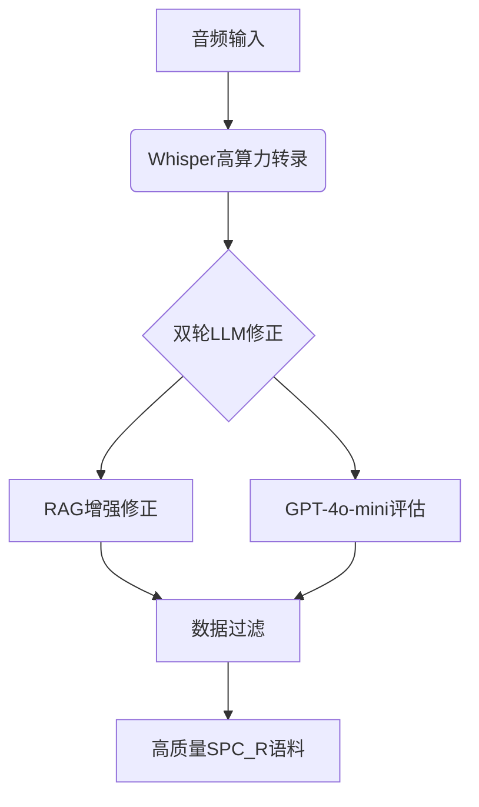

# Swiss Parliaments Corpus Re-Imagined (SPC_R): 基于RAG修正与预测BLEU的增强转录研究解读

## 1. 研究背景与动机

瑞士德语作为典型低资源语言，其自动语音识别(ASR)面临数据稀缺和技术挑战。原始瑞士议会语料库(SPC)存在三个关键问题：
- **数据限制**：仅176小时句子级对齐，缺少长文本语料
- **质量缺陷**：命名实体错误率高达27.8%（准确率72.2%）
- **评估缺失**：缺乏自动化质量筛选机制

研究团队提出构建增强版SPC_R语料库，核心目标包括：
- 将801小时议会音频转化为长文本对齐语料
- 将命名实体准确率提升至100%
- 建立预测BLEU等自动化质量评估体系

## 2. 方法原理与流程

### 2.1 整体框架（三阶段流水线）


### 2.2 关键技术解析

**阶段1：高精度ASR转录**
- 模型：Whisper Large-v3 (16-bit浮点)
- 超参数：beam_size=10, best_of=10
- 质量指标：平均对数概率$\text{avg_log_prob}$

**阶段2：RAG增强修正**
- 架构：
  ```python
  def rag_correction(text):
      retrieved = faiss_search(official_texts, text)  # 600字符窗口
      return gpt4o_correct(text, retrieved)  # 实体修正规则应用
  ```
- 命名实体修正示例：
  - 原始："vo dr" → 修正："von der"
  - 错误率降低100%（从27.8%→0%）

**阶段3：预测BLEU过滤**
- 核心公式：
  $$\text{Predicted BLEU} = 1.59 \times \exp\left(\frac{1}{N}\sum p_i\right) - 0.68$$
  - $R^2=0.91$（基于10测试集）
- 双重过滤标准：
  - Predicted BLEU > 65
  - 语义完整性=3（最高等级）

## 3. 实验设计与结果

### 3.1 关键指标对比
| 指标            | 原始SPC | SPC_R  | 提升幅度 |
|-----------------|--------|--------|---------|
| WER             | 15.7%  | 11.1%  | ↓29.3%  |
| 命名实体准确率   | 72.2%  | 100%   | ↑38.5%  |
| BLEU            | 基准值 | +6点   | -       |

### 3.2 质量评估体系
- GPT-4o-mini评判器：
  - 4级质量标签（0-3）
  - 通过token合并策略实现92.2%评估准确率
- 数据保留情况：
  - 原始801小时 → 最终751小时（过滤率6.2%）

## 4. 亮点评价与不足分析

### 核心创新点
1. **技术组合创新**：
   - 首创Whisper+RAG+预测BLEU的三级流水线
   - 开发基于avg_log_prob的BLEU预测模型（R²=0.91）

2. **语料构建突破**：
   - 751小时瑞士德语-标准德语对齐语料（当前最大规模）
   - 100%命名实体准确率的政治领域语料

### 现存不足
1. **方法局限**：
   - RAG检索依赖协议文本质量
   - 未验证跨语言泛化性（仅瑞士德语场景）

2. **实验缺陷**：
   - 缺少不同会期的WER波动分析
   - 未开源代码和预测模型

## 5. 总体评价与启示

**学术价值**：★★★★☆  
- 为低资源语言语料构建建立新范式
- 政治/法律NLP研究的基础设施突破

**应用前景**：★★★★★  
- 可扩展至其他议会转录场景
- 预测BLEU方法有望成为ASR评估新标准

**改进方向**：
1. 增加动态时间规整(DTW)验证模块
2. 公布计算成本指标（如GPU小时消耗）
3. 开放部分校验集促进领域发展

> 该研究通过创新技术组合，不仅解决了瑞士德语语料稀缺问题，其提出的预测BLEU指标和RAG增强修正框架，为其他低资源语言处理提供了可借鉴的方法论路径。