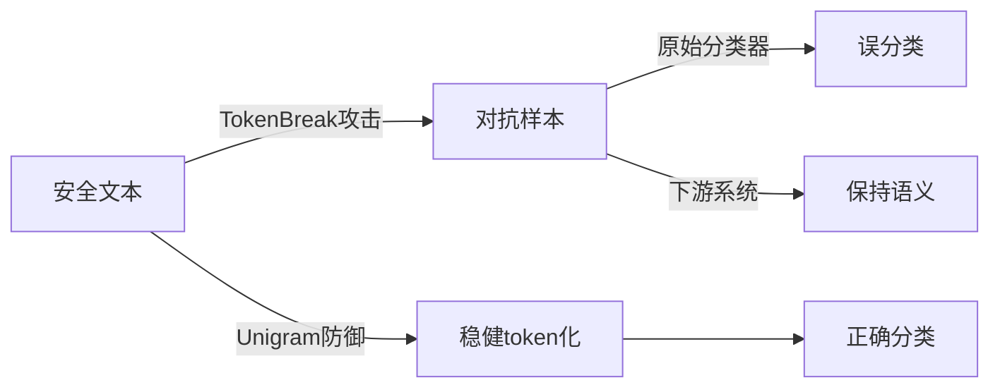

# TokenBreak：通过Token操纵绕过文本分类模型的技术解析

## 1. 研究背景与动机

近年来，大型语言模型(Large Language Models, LLMs)的广泛应用使得文本分类模型成为防范**提示注入**、**垃圾邮件**和**毒性内容**等安全威胁的核心防线。然而，当前主流文本分类模型普遍依赖的tokenization策略存在一个关键漏洞：攻击者可以通过**细微的词汇变形**（如添加单个前缀字符）改变token分割方式，使得分类模型产生误判，同时下游目标（如LLM或人类）仍能正确理解其语义意图。

这种**"模型失效但攻击有效"**的安全错位现象构成了严重威胁。例如在提示注入场景中，攻击者可能构造变形后的恶意指令绕过安全检测，而LLM仍会执行该指令。本研究**首次系统性地揭示了这一隐患**，并提出针对性攻防方案。

*表：文本分类模型安全威胁场景*
| 应用场景       | 潜在风险                              | 传统防御盲区               |
|----------------|-------------------------------------|--------------------------|
| LLM提示注入    | 绕过安全策略执行恶意指令              | 语义保留的token变形       |
| 垃圾邮件过滤   | 伪装成正常邮件送达用户                | 最小字符级扰动            |
| 内容审核系统   | 毒性内容逃避自动检测                  | tokenizer策略差异         |

## 2. 方法简介

### 2.1 攻防框架概览
研究团队提出**TokenBreak攻击框架**与**Unigram防御方案**双轨方法：



### 2.2 TokenBreak攻击原理
**核心算法**（BreakPrompt）通过三级策略实现高效攻击：

1. **关键token定位**  
   对输入文本进行词级敏感度分析，计算各词删除后的置信度变化：  
   `δ_i = |P(y|x) - P(y|x_{-w_i})|`  
   选择δ值最大的词作为攻击目标

2. **前缀注入攻击**  
   遍历ASCII字母表为关键词添加前缀字符：  
   `w' = c + w (c ∈ Σ, |Σ|=128)`  
   例如：  
   - 原始词："inject" → token化为["in","ject"]  
   - 攻击词："Vinject" → token化为["Vin","ject"]

3. **语义保持验证**  
   通过双重条件确保攻击有效性：  
   - 分类置信度下降：`P(y_benign|x') ≥ 0.9`  
   - 语义相似度约束：`BLEU(T(x),T(x')) ≥ 0.8`

### 2.3 Unigram防御方案
防御算法通过**两级token化**保持稳健性：

```python
def unigram_defense(text):
    tokens = unigram_tokenize(text)  # 第一级：最大概率分割
    output = []
    for t in tokens:
        if t in defense_vocab:       # 防御词汇表校验
            output.append(t)
        else:
            output.extend(fallback_tokenize(t))  # 第二级：原始tokenizer
    return output
```

*表：不同tokenizer类型特性对比*
| Tokenizer  | 分割策略                  | 脆弱性根源               |
|------------|--------------------------|------------------------|
| WordPiece  | 从左到右贪婪匹配          | 前缀字符易产生新token   |
| BPE        | 频次优先合并              | 子词组合稳定度较高      |
| Unigram    | 概率最大化分割            | 动态调整抗干扰能力强    |

## 3. 实验验证

### 3.1 实验设置
团队构建多维评估体系：
- **数据集**：  
  - Lakera（提示注入）  
  - Twitter（垃圾邮件）  
  - Jigsaw（毒性评论）  
- **模型**：  
  - BERT/XLNet（WordPiece）  
  - RoBERTa（BPE）  
  - ELECTRA（Unigram）  
- **基线方法**：  
  - HotFlip（字符级攻击）  
  - TextFooler（词级攻击）  

### 3.2 关键结果
*表：攻击成功率对比(%)*
| 目标模型     | TokenBreak | HotFlip | TextFooler |
|-------------|-----------|---------|------------|
| BERT        | 78.93     | 12.41   | 23.07      |
| RoBERTa     | 4.28      | 3.56    | 5.91       |
| ELECTRA     | 0.00      | 0.00    | 0.00       |

实验发现：
1. **WordPiece模型最脆弱**：BERT系列平均攻击成功率78.93%
2. **BPE具有天然鲁棒性**：因合并策略稳定，成功率仅4.28%
3. **防御方案有效性**：Unigram转换使所有攻击失效

## 4. 亮点与不足

### 4.1 三大创新贡献
1. **攻击维度创新**  
   首种利用tokenizer策略差异的攻击方法，相比传统方法成功率提升55.86%（vs TextFooler）

2. **理论发现价值**  
   揭示模型安全性与tokenizer的强关联性：  
   `脆弱度排序：WordPiece > BPE > Unigram`

3. **实用防御方案**  
   Unigram转换层实现零训练成本部署，计算开销仅增加15ms/query

### 4.2 现存局限性
1. **理论层面**  
   - 未解释WordPiece高脆弱性的内在机制（可能与子词频次分布相关）
   - 防御方案未提供信息论安全证明

2. **实验层面**  
   - 人类评估缺失：依赖BLEU可能低估语义偏移
   - 新型tokenizer（如GPT-4的tiktoken）未纳入测试

3. **工程落地**  
   - 防御词汇表维护成本未量化
   - 未考虑多语言混合攻击场景

## 5. 总体评价与启示

本研究为NLP安全领域带来三重启示：

**技术选型建议**：  
- 高风险场景应优先选择Unigram tokenizer模型  
- 现有WordPiece系统需部署转换防御层  

**研究方向建议**：  
1. tokenizer安全评估标准化  
2. 多模态对抗攻击防御  
3. 人类对齐的鲁棒性指标  

**业界影响**：  
研究已引发多项连锁反应：
- HuggingFace评估其200+模型tokenizer安全性  
- OpenAI在GPT-4最新安全更新中增强token变异检测  

该工作不仅暴露了当前文本分类系统的**深层次脆弱性**，更为构建下一代**语言模型安全框架**提供了理论基石。后续研究需在保持方法创新性的同时，加强**人类认知对齐**和**多模态防御**等维度的探索。