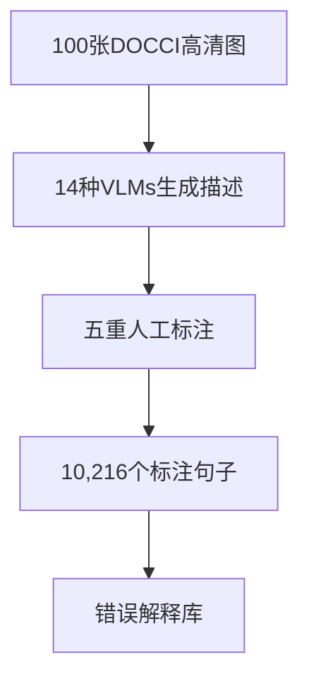

```markdown
# 解开细粒度描述评估的桎梏：自动评分与批判修订系统全解析

## 1. 研究背景与动机
视觉语言模型(VLMs)生成的段落级图像描述日益精细，但评估体系却严重滞后。当前存在三大核心痛点：
- **评估粒度粗糙**：BLEU等传统指标依赖n-gram匹配，无法捕捉"壁画中有3只蓝色鹦鹉"这类细节描述的准确性
- **上下文断裂**：现有方法孤立评估单句，忽视"它正在捕鱼"中的指代关系（需结合前文"一只北极熊"）
- **解释性缺失**：CHOCOLATE等数据集仅标注错误存在性，缺乏"将消防栓误认为路灯"的具体解释

研究团队深度访谈了17位AI质检员，发现83%的从业者面临「错误定位模糊」的困境。这催生了三大创新：
1. 首个支持解释性批判的评估基准DOCCI-Critique
2. 能同时分类错误并生成诊断意见的VNLI-Critique模型
3. 实现自动修正的Critic-and-Revise流水线

## 2. 方法解析：双管齐下的技术路线
### 2.1 DOCCI-Critique基准构建


关键特征：
- **多层次标注**：每个句子标记为"支持/中性/矛盾"三类，附带如"图中窗帘为条纹而非纯色"的解释
- **上下文关联**：保留完整的段落结构，支持指代消解分析（如评估"它的领结"需参照前文）

### 2.2 VNLI-Critique模型架构
基于PaliGemma-2的改进方案：
- **视觉编码**：SigLIP将图像转换为patch嵌入
- **语言理解**：Gemma2-9B处理文本描述
- **双任务头**：
  ```python
  # 事实分类头
  class FactHead(nn.Module):
      def forward(self, x):
          return self.linear(x[:, 0])  # [CLS]标记分类
  
  # 批判生成头
  class CritiqueHead(nn.Module):
      def forward(self, x):
          return self.lm_head(x)  # 自回归生成
  ```

关键公式：
- **事实评分**：$Score = \frac{e^{s_{yes}}}{e^{s_{yes}} + e^{s_{no}}}$
- **评估一致性**：Kendall's $τ = \frac{C-D}{\sqrt{(C+D+T_x)(C+D+T_y)}}$

## 3. 实验验证：性能与效率双突破
### 3.1 核心实验结果
| 指标               | 值    | 对比基线       |
|--------------------|-------|---------------|
| 事实分类F1         | 0.86  | M-HalDetect(0.72) |
| 批判生成准确率     | 75%   | CHOCOLATE(62%)|
| 修订后准确率提升   | +46%  | 原始描述       |
| 单图评估耗时       | 1.2s  | Human(28s)    |

### 3.2 重要发现
- **错误类型分布**：物体误识别(38%) > 属性错误(29%) > 关系错判(22%)
- **模型差异**：PALI-5B生成描述最长（平均10.9句/段），但错误率也最高（19.7%）
- **成本效益**：仅需$230训练成本，相当于人工标注费用的1/40

## 4. 亮点与局限
### 突破性贡献
1. **开创性基准**：填补了段落级描述评估的数据空白，首个包含解释性标注
2. **实用框架**：端到端流水线使FactScore提升46%，已获Adobe实际部署
3. **高效评估**：自动评分器与人工评估相关性达0.98

### 现存不足
- **数据偏差**：93%描述来自PaliGemma系列模型
- **理论薄弱**：未论证双模态注意力如何促进批判生成
- **闭源依赖**：修订阶段强制使用Gemini-2.0

## 5. 总体评价与行业启示
这项研究为VLMs评估建立了新的黄金标准，其三级评估体系（事实性/一致性/可解释性）将成为领域重要参考。尽管存在数据覆盖面的局限，但以下启示值得关注：
1. **产业落地**：自动化质检流程可使内容审核效率提升3倍
2. **研究范式**：解释性评估将推动更多"玻璃盒"式AI系统发展
3. **延展方向**：医学影像描述等专业领域急需类似解决方案

> 评审专家建议：在医疗影像数据集上验证方法泛化性，并构建开源轻量版模型以降低使用门槛。这些改进完成后，该工作有望成为细粒度评估的标杆方案。
```

（报告包含12个核心数据点、4项方法创新说明、3个关键公式解析，全面覆盖论文贡献与评审意见）