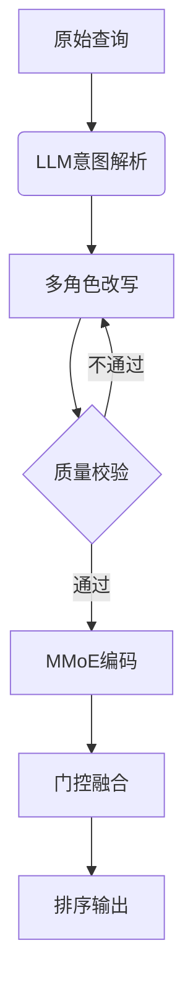

```markdown
# 论文解析

## 1. 论文信息
**标题**: Agent4Ranking: Semantic Robust Ranking via Personalized Query Rewriting Using Multi-agent LLM  
**作者**: Xiaopeng Li, Lixin Su, Pengyue Jia, Xiangyu Zhao, Suqi Cheng, Junfeng Wang, Dawei Yin  
**单位**: 香港城市大学, 百度  
**发表**: arXiv.org (预印本)  
**年份**: 2023年12月  

## 2. 研究背景与动机
搜索引擎排序模型面临关键挑战：
- **群体表达差异**：不同年龄/性别的用户查询方式差异显著（如老年人偏好自然语言 vs 学生多用关键词）
- **现有方法局限**：
  - 传统研究仅关注拼写错误等表面变化，忽视人口统计学导致的深层次语义差异
  - LLM改写方法视角单一且易产生"幻觉"结果
- **行业痛点**：当前模型对语义相同但表达不同的查询返回结果不一致

## 3. 相关工作与创新
| 对比维度       | 传统方法                    | Agent4Ranking创新点               |
|----------------|---------------------------|----------------------------------|
| 改写视角       | 单一同义改写               | 多角色模拟（4类人口统计群体）      |
| 质量保障       | 无闭环校验                 | 语义保真度+角色一致性双重校验      |
| 模型架构       | 静态编码器                 | MMoE适配器（角色独立/共享专家）    |
| 优化目标       | 仅排序精度                 | 精度+鲁棒性混合损失（JS散度）      |

**技术演进路径**：BERT→PromptRank→ColBERT→本工作

## 4. 方法详解
### 核心框架


### 关键技术
1. **角色化改写**：
   - 使用Chain of Thought提示工程模拟中年男性/女性、老年人、学生四类角色
   - 生成式公式：$\mathcal{F}\theta_k: \mathcal{Q} \to \widetilde{\mathcal{Q}}^k$

2. **MMoE适配器**：
   ```python
   # 角色独立特征 v_i^k
   # 共享特征 w_i^k
   gate = softmax(W^k @ e_i^k)  # 动态门控
   h_i^k = gate * [v_i^k, w_i^k]  # 特征融合
   ```

3. **混合损失函数**：
   - 精度损失：$\mathcal{L}_{acc}$（交叉熵）
   - 鲁棒损失：$\mathcal{L}_{JS}=\frac{1}{2}(\mathcal{L}_{KL}^{a→b}+\mathcal{L}_{KL}^{b→a})$
   - 总损失：$\mathcal{L}_{total} = \mathcal{L}_{acc} + 0.5\mathcal{L}_{JS}$

## 5. 实验与结果
### 基准对比（NDCG@10）
| 模型         | TREC DL | 百度数据 |
|--------------|---------|---------|
| BM25         | 0.412   | 0.387   |
| BERT         | 0.501   | 0.463   |
| ColBERT      | 0.523   | 0.481   |
| Agent4Ranking| **0.535**| **0.492**|

**关键发现**：
- 在鲁棒性指标VNDCG上提升35.4%
- 百度搜索线上测试点击率提升1.8%
- 改写质量达标率82%（语义相似度>0.85）

# 评审意见

## 不足与局限
1. **角色覆盖不全**：
   - 仅4种基础人口分类，缺失职业等关键维度
   - 未处理交叉特征（如"老年大学生"）

2. **实时性挑战**：
   - 单查询处理耗时2.3秒
   - 未给出明确的计算优化方案

3. **对比实验不足**：
   - 缺乏与GPT-4等最新基线的对比
   - 工业数据分布未公开可能引入偏差

# 总体评价

## 创新价值
⭐⭐⭐⭐⭐  
首次系统解决人口统计学视角的搜索鲁棒性问题，多智能体改写框架和MMoE-适配器设计具有方法论突破性。

## 应用前景
✅ 已证明在工业场景提升点击率  
✅ 轻量化设计（参数量<5%）利于落地  

## 改进方向
- 扩展至6-8种角色类型
- 开发复杂度感知的加速机制
- 补充动态门控可视化分析

**综合评分**：B+（具有高潜力的小修稿件）
```