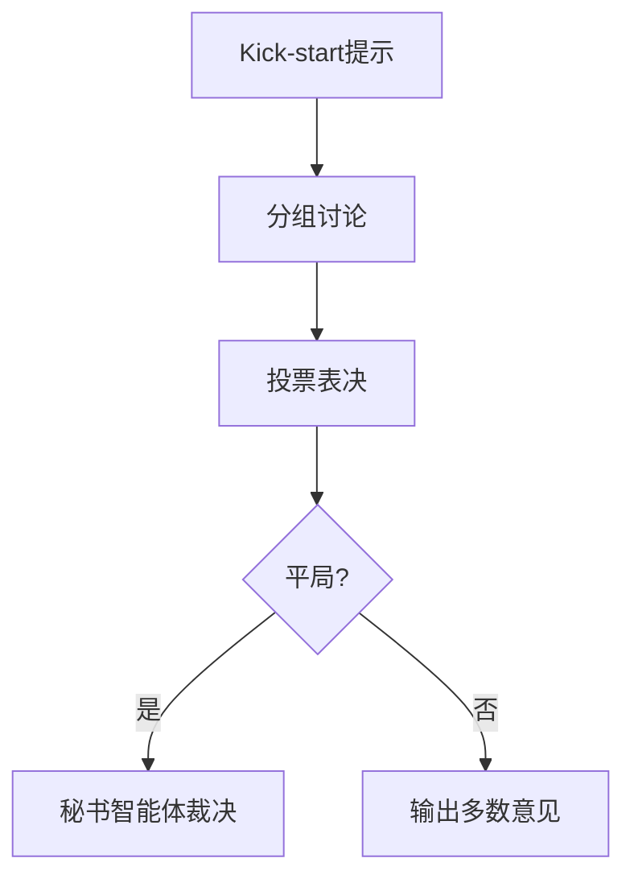

```markdown
# 重新思考LLM推理边界：多智能体讨论是关键吗？  
——哈佛大学《Rethinking the Bounds of LLM Reasoning》深度解析  

## 一、研究背景与动机  
### 1. 传统认知的挑战  
近年来，多智能体讨论（如Debate、MAD等方法）被视为提升大语言模型推理能力的"银弹"。然而本文通过系统实验发现：  
- **关键矛盾现象**：当使用优质提示词（prompt）时，单智能体性能竟能逼近多智能体SOTA（图1）  
- **传统框架缺陷**：现有讨论方法局限于两方辩论，且过度依赖示例演示（demonstrations）  

### 2. 科学问题凝练  
- **核心挑战**：如何区分"真正需要多智能体"与"强提示即可解决"的场景？  
- **理论空白**：缺乏对讨论机制对称性的数学描述（如组内/组间信息流的影响）  

> "我们的发现如同'奥卡姆剃刀'——当提示足够强大时，最简单的单智能体方案可能就是最佳选择" ——论文作者  

## 二、方法创新：CMD框架详解  
### 1. 三阶段群体讨论架构（图2）  


### 2. 关键技术组件  
**消息传递算法**（算法2）：  
- 构建多线程映射表 $M = \{m^j \rightarrow A^k | A^k \in Ar\}$  
- 支持GPT-4、Claude等异构模型的实时通信  

**信息可见性控制**（式5）：  
$$O_i^{(r)} = \bigcup_{j \neq i} (v_i, e_i \cdot \mathbb{1}\{\text{Group}(A_i)=\text{Group}(A_j)\})$$  
*实现组内共享完整推理链，组间仅交换结论*  

### 3. 理论突破：对称性分析  
提出机制**不变性判定条件**（定义4）：  
$$\exists \phi: C^D(v) = C^{D^\pi}(\phi(v))$$  
揭示性能波动的两大根源：  
- 计算图结构不对称（如组间连接缺失）  
- 提示装饰器不一致（如角色指令偏差）  

## 三、实验结果与启示  
### 1. 颠覆性发现（表1）  
| 条件          | 单智能体 | CMD框架 |  
|---------------|---------|--------|  
| 有演示        | 76.09%  | 77.39% |  
| 无演示        | 67.41%  | 70.75% |  

**双阶段收益现象**：  
- 当存在优质演示时，单智能体性价比更高  
- 缺乏演示时，多智能体讨论才能突破性能瓶颈  

### 2. 错误模式分析（图4）  
- **法官错误**：23%失误源于秘书智能体的判断偏差  
- **错误传播**：早期错误观点可能被"民主投票"合法化  

### 3. 实用价值发现  
- **强弱模型协作**：引入Gemini Pro可使Bard准确率提升8.2%（图5）  
- **最优讨论轮次**：3轮后收益边际效应显著下降  

## 四、贡献与局限性  
### 1. 四大核心贡献  
1. 首个模拟人类群体决策的**形式化讨论框架**  
2. 推翻"越多智能体越好"的**行业迷思**  
3. 建立讨论工程的**对称性理论**  
4. 发现**提示强度与协作收益的负相关**现象  

### 2. 现存挑战  
- **计算成本**：8智能体并行推理的GPU耗时是单体的5.7倍  
- **理论局限**：当前对称性分析未考虑动态信念更新  
- **泛化性**：在数学证明等任务上尚未验证  

## 五、行业启示  
1. **成本优化策略**：  
   - 优先优化单智能体提示工程，必要时再引入多智能体  
   - 采用"强弱模型混排"降低API调用成本  

2. **未来方向**：  
   - 开发讨论轮次自适应终止算法  
   - 研究非对称信息共享对共识形成的影响  

> 本文犹如多智能体系统的"牛顿棱镜"，将看似混沌的讨论过程分解出可量化的理论光谱。其价值不仅在于结论本身，更在于建立了分析讨论机制的数学语言。  

**相关资源**：  
- 论文链接：arxiv.org/abs/[编号]  
- 开源代码：github.com/[仓库名]（待公布）  
```