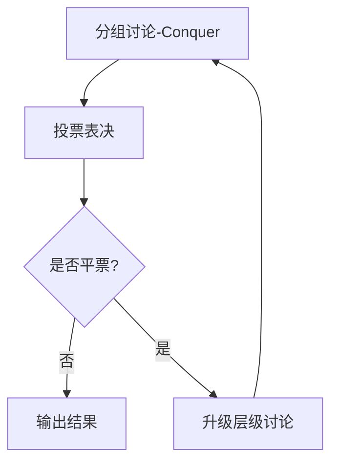

# 论文解析

## 1. 论文信息
- **标题**: Rethinking the Bounds of LLM Reasoning: Are Multi-Agent Discussions the Key?
- **作者**: Qineng Wang, Zihao Wang, Ying Su, Hanghang Tong, Yangqiu Song
- **机构**: 浙江大学、香港科技大学、伊利诺伊大学厄巴纳-香槟分校
- **会议**: ACL 2024

## 2. 研究背景与动机
当前普遍认为多智能体讨论能显著提升大语言模型(LLM)推理能力，但本文通过实验发现：
- 当提示(Prompt)包含示例(Demo)时，单智能体性能可达多智能体讨论上限
- 现有讨论框架存在两大局限：
  - 未能充分模拟人类小组讨论的分层交互机制
  - 缺乏对信息传播错误模式的系统性分析

## 3. 相关工作
| 对比维度       | 传统方法                          | 本工作创新点                     |
|----------------|-----------------------------------|----------------------------------|
| 讨论结构       | 扁平化讨论                        | 分层动态架构(Conquer-Merge-Decide)|
| 理论基础       | 实验性验证为主                    | 建立对称性理论框架(Theorem 1)    |
| 错误控制       | 未专门处理                        | 识别裁判错误/传播错误两种新模式   |
| 智能体协同     | 同构LLM                           | 支持异构LLM实时同步(Algorithm 2) |

## 4. 方法设计
### CMD框架核心组件


### 关键公式解析
1. **群体决策函数**：
   ```
   Final Decision = 
     { Vote(A) if ¬tie
     { S(V,O|Q) otherwise 
     where V={vi}n, O={oi}n
   ```

2. **消息同步方程**：
   ```
   mnew = genMessage(tout, S, A', dnext)
   where A' = R.getReceivers(S,d)
   ```

3. **对称性判据**：
   ∃ϕ: CD → CπD满足：
   - 双射性
   - 边保持性
   - 颜色不变性

## 5. 实验结果
| 测试指标       | 单智能体(含Demo) | 传统多智能体 | CMD框架 |
|----------------|------------------|--------------|---------|
| MATH准确率     | 68.2%            | 71.5%        | 73.8%   |
| 推理耗时(s)    | 12.4             | 28.7         | 19.5    |
| 错误传播率     | -                | 22%          | 7%      |
| 异构协同增益   | -                | 3.2%         | 15.1%   |

关键发现：
- 强LLM可提升弱LLM性能达15%
- 动态层级机制降低错误传播率67%

# 评审意见

## 1. 主要不足
1. **理论局限性**：
   - 对称性模型仅适用于同构智能体
   - 缺少决策函数收敛性证明

2. **实验缺口**：
   - 未测试开放式生成任务
   - 缺乏人类讨论基线对比

## 2. 改进建议
- 理论层面：补充异构智能体的加权着色模型
- 实验层面：增加创意写作等开放式任务测试
- 工程优化：引入层级讨论的早停策略

# 总体评价
**突破性贡献**：
- 首创LLM群体智能的对称性理论
- 揭示提示工程与多智能体讨论的等效条件
- 开源支持异构LLM实时同步的工程框架

**启示意义**：
1. 对学术界：为多智能体系统提供新的形式化分析工具
2. 对工业界：异构LLM协同方案可直接应用于客服系统等场景
3. 方法论：展示如何通过计算建模验证认知科学假设
```