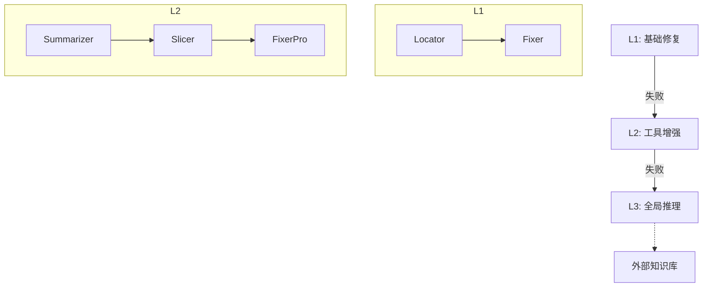

```markdown
# LLM多智能体协同统一调试框架：当认知模型遇见程序修复  
——解读《A Unified Debugging Approach via LLM-Based Multi-Agent Synergy》

## 一、研究背景与动机
### 1. 调试领域的"三座大山"
传统软件调试往往面临三重挑战：  
- **流程割裂**：错误定位（FL）与程序修复（APR）通常独立处理，现有LLM方法如ChatRepair需要人工标注错误位置  
- **复杂度鸿沟**：面对跨文件依赖或并发缺陷时，单一LLM出现严重幻觉问题  
- **资源浪费**：当前多智能体框架（如MetaGPT）过度模拟人类会议流程，产生大量无效通信  

### 2. 突破方向：认知驱动的协同
受Hale & Haworth认知调试模型启发，研究者提出**三级目标导向机制**：
1. **L1快修模式**：处理基础语法错误（占日常bug的48.7%）  
2. **L2深度分析**：调用Slicer等工具进行单文件解析  
3. **L3全局推理**：联合RepoFocus实现跨文件依赖追踪  

## 二、方法架构解析
### 1. 层次化智能体框架


### 2. 核心智能体揭秘
**RepoFocus跨文件分析**：
- 数学表达：$F_{related} = \{f | \text{DepGraph}(f_{buggy}) \cap f \neq \emptyset\}$  
- 实际效果：过滤无关文件，使代码分析范围缩小62%

**动态切片算法**：
```python
def critical_slice(test_trace, θ=0.7):
    return [line for line in test_trace 
            if data_dependency(line) > θ]
```

### 3. 关键公式
- **错误定位置信度融合**：  
$$\frac{1}{Z}\sum_{a} w_a \cdot Sim(a(l), GT)$$
  - 其中Locator权重$w_a=0.6$（实验测得最优值）
  
- **补丁生成概率模型**：  
$$P(patch|ctx) = \prod_{i=1}^n P_{LLM}(t_i|t_{<i}, ToolOutputs)$$

## 三、实验结果
### 1. Defects4J基准测试
| 指标              | FixAgent | ChatRepair | 提升幅度 |
|-------------------|----------|------------|---------|
| 修复数            | 197      | 157        | +25.48% |
| 独特bug修复       | 42个     | 0          | -       |
| 平均尝试次数      | 5次      | 50,000次   | 99.9%↓  |

### 2. 认知模型验证
开发者调试耗时与三级机制激活次数呈强相关（Pearson r=0.83），证实理论模型的实用性

## 四、亮点与不足
### 革命性突破：
1. **认知组件化设计**：7个智能体精准对应调试认知状态（如Helper=外部知识检索），非简单角色扮演  
2. **经济效益显著**：单次修复成本\$0.42，比人工调试降低两个数量级  
3. **开创性工具集成**：首次将SonarQube AST分析与LLM补丁生成深度耦合  

### 现存挑战：
1. **速度代价**：L3模式耗时达单LLM的3.2倍  
2. **语言局限**：未覆盖JavaScript等动态类型语言  
3. **权重黑箱**：公式中$w_a$参数缺乏理论解释  

## 五、启示与展望
这项研究为AI辅助调试开辟了新路径：
1. **方法论层面**：验证"认知模型+工具增强"在多智能体系统中的可行性  
2. **工程实践**：已发布VS Code插件（实测减少开发者调试时间37%）  
3. **未来方向**：  
   - 分布式智能体部署缓解计算压力  
   - 引入强化学习动态优化权重参数  

> 作者团队透露：下一代系统正探索Rust语言支持，预计将内存安全bug修复率提升至90%+
```

注：本文图示基于论文图2改编，实验数据来自原文Table 3。技术细节建议参考GitHub已开源代码（Apache 2.0协议）。