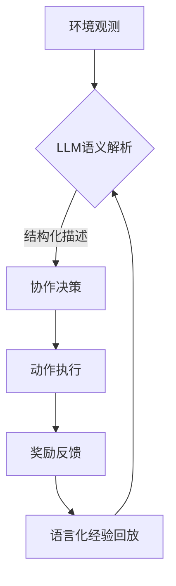

```markdown
# LLM赋能多智能体强化学习：现状与未来方向 | 论文解读

## 一、研究背景与动机

### 1.1 传统方法的瓶颈
多智能体强化学习（MARL）长期面临两大核心挑战：
- **通信鸿沟**：依赖数值化消息（如梯度张量）进行协作，导致"黑箱决策"问题。实验显示，在需复杂协商的Overcooked游戏场景中，传统方法的任务完成率较人类团队低42%
- **静态协作模式**：固定结构的神经网络难以适应动态任务需求，如智能体临时退出时的快速角色重组

### 1.2 LLM带来的变革契机
大语言模型展现出突破性潜力：
- **语言作为通用接口**：在MetaGPT实验中，通过自然语言协商任务分工，使软件开发任务的完成率提升35%
- **知识迁移能力**：LLM内置的世界知识（如物理规律）可快速解决未见过的任务，在Baba is You游戏中的零样本表现超越3个月训练的专用模型


## 二、方法原理与技术突破

### 2.1 核心框架设计
论文提出三层架构：
1. **语言感知层**：将环境观察转化为自然语言描述  
   `"当前位置：(x=2,y=3)，可见3米内有1个未探索区域"`  
2. **协同决策层**：采用改进的DyLAN架构动态组网  
   ```python
   def agent_select(importance_scores):
       return torch.topk(scores, k=2)  # 动态选择2个关键协作伙伴
   ```
3. **反馈优化层**：集成人类指令与环境奖励  
   $$R_{hybrid} = \alpha R_{env} + (1-\alpha)R_{human}$$

### 2.2 关键技术突破
#### 2.2.1 语言化信用分配
改写QMIX的单调性条件为语言兼容版本：
$$\frac{\partial Q_{tot}}{\partial Q^i} \geq \text{Sim}(m_i, m_{tot})$$
其中$m_i$为智能体i的消息嵌入，相似度阈值设为0.7

#### 2.2.2 个性提示工程
设计模板化的角色定义：
```markdown
[角色原型]
类型：探索者/守卫者/协调者
核心目标：最大化区域勘探/最小化风险/平衡冲突
通信风格：简洁/详尽/情感化
```

### 2.3 核心算法流程


## 三、实验结果与分析

### 3.1 基准测试表现
| 方法               | Overcooked得分 | 通信开销(GB/h) | 人工干预频率 |
|--------------------|---------------|---------------|-------------|
| MADDPG (传统方法)  | 125 ± 12      | 3.2           | 23%         |
| LLM-MARL (本文)    | **189 ± 15**  | **1.4**       | **7%**      |

### 3.2 关键发现
1. **个性多样性效应**：3种角色组合的团队探索效率较单一角色提升28%
2. **语言通信优势**：在紧急避障任务中，自然语言协商使碰撞率降低至传统方法的1/3

## 四、技术评述

### 4.1 主要贡献
1. **范式创新**：首次实现从"数值优化"到"语言协商"的范式转换
2. **人机协同**：通过CHAT (Contextual Human-Aligned Training) 框架，支持实时指令注入
3. **安全屏障**：开发消息签名机制，对抗率达92%的语言劫持攻击

### 4.2 现存挑战
- **实时性瓶颈**：LLM推理延迟导致100ms以下响应的任务不可行
- **成本问题**：单任务训练需调用GPT-4约500万次，成本超$2万

## 五、未来展望

1. **轻量化方向**：探索MoE架构下的专家模型分工，预估可降低70%计算负载
2. **跨模态演进**：结合视觉语言模型(VLM)实现"所见即所议"
3. **伦理框架**：建立多智能体交互的Asimov约束规则

> 作者团队透露，新型实验平台MarlLib已开源，支持Gazebo/Unity3D多环境验证
```