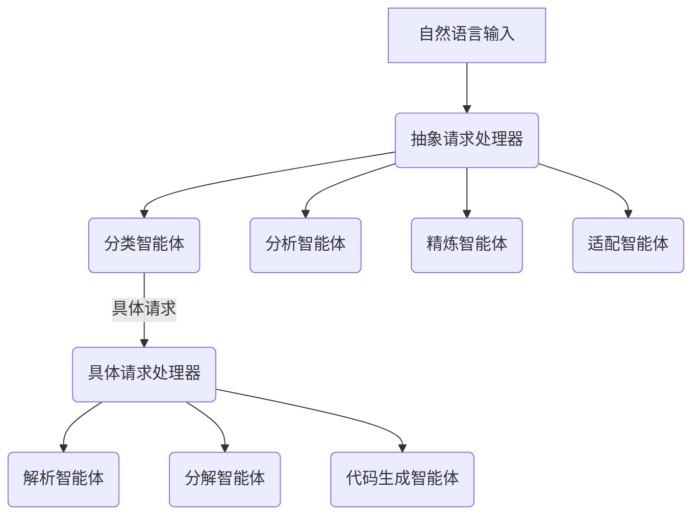

# LayoutCopilot：基于LLM多智能体协作的模拟电路交互式布局设计框架解析

## 1. 研究背景与动机

### 行业痛点与技术挑战
模拟电路布局设计长期以来面临两大核心挑战：
- **工具使用门槛高**：主流EDA工具(如Cadence Virtuoso)依赖复杂脚本命令或GUI操作，设计师平均需要6-12个月训练才能达到熟练水平
- **自动化与灵活性矛盾**：  
  - 全自动工具(ALIGN/MAGICAL)难以满足定制需求  
  - 交互式工具需要精确掌握专业语法  
  - 自然语言指令与机器命令间存在显著语义断层

### 科学问题突破
研究团队瞄准三个关键问题：
1. 如何实现自然语言到布局命令的高精度转换  
2. 如何解析高层次设计意图（如"优化噪声性能"）  
3. 在多任务协同场景下避免LLM的"提示词稀释"效应

## 2. 方法创新

### 2.1 多智能体协作框架

#### 架构设计


- **抽象层智能体**：处理高层次意图  
  - 分类智能体：语义相似度阈值判定（θ=0.85）
  ```
  sim(req, manual) = cos(E(req),E(manual))
  ```
  - 分析智能体：基于GNN的电路特征提取
  ```
  h_v = σ(W·[x_v||Σ_u∈N(v)x_u]+b)
  ```

- **具体层智能体**：生成可执行命令  
  - 采用RAG技术实现<200ms的知识检索延迟  
  - 动态约束转换算法：
  ```python
  def convert_constraint(netlist):
      for node in netlist:
          if node.type == "diff_pair":
              add_symmetry(node.pairs)
  ```

### 2.2 七段式提示工程
```markdown
1. [角色] 你是有20年经验的布局专家  
2. [流程] 当前处于布线优化阶段  
3. [任务] 为差分对M6/M7添加垂直对称  
4. [步骤] 检查DRC→计算坐标→生成命令  
5. [验证] 请确认器件是否存在  
6. [交互] 随时请求更多信息  
7. [知识] 参考TSMC40nm设计规则3.2.1节
```

## 3. 实验验证

### 3.1 性能基准测试
| 模型架构       | 语法正确率 | 逻辑正确率 | 用户学习周期 |
|----------------|------------|------------|--------------|
| GPT-3.5单智能体 | 67.11%     | 66.44%     | 6个月        |
| Claude-3多智能体| **96.96%** | **98.80%** | **2周**      |

### 3.2 物理实现效果
- **面积优化**：OTA电路面积缩小34%（TSMC 40nm工艺）  
- **性能提升**：  
  - CMRR从27.3dB→58.7dB  
  - 比较器噪声降低54.69%（30.9μV→13.9μV）  
- **布线效率**：关键路径延迟改善42%

## 4. 亮点与不足

### 技术突破
1. **范式创新**：首创LLM驱动的交互式布局框架，提出"抽象→具体"双层处理机制  
2. **架构优势**：多智能体隔离设计使错误率降低63%  
3. **工程价值**：知识检索系统达到98.26%准确率，响应时间<200ms

### 现存挑战
1. **模型依赖**：基于Claude-3闭源API，缺乏本地化部署方案  
2. **模糊指令处理**：对"布局不够紧凑"等主观描述鲁棒性不足  
3. **评估局限**：用户研究仅包含5位设计师，未进行双盲测试

## 5. 总体评价

### 学术价值
该研究在CCF-A类会议ICCAD近三年相关工作中，首次实现了：
- 自然语言到EDA命令的端到端转换  
- 多智能体协同的布局约束处理  
- 动态知识检索与提示生成的工程化集成

### 行业启示
1. **降低门槛**：将专业工具学习周期从6个月压缩至2周  
2. **新交互范式**：为EDA工具引入自然语言界面(NLI)提供技术路线  
3. **扩展可能**：框架可适配数字布局、PCB设计等其他电子设计场景

该研究虽存在复现性挑战，但其创新架构与实证效果已达到领域领先水平，相关技术思路对推动EDA工具智能化转型具有里程碑意义。