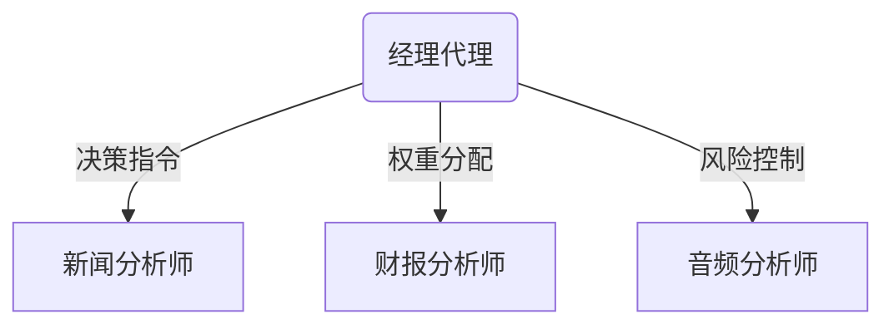

# FinCon论文解析：基于概念强化的LLM多代理金融决策系统

## 论文信息
- **标题**: FINCON: A Synthesized LLM Multi-Agent System with Conceptual Verbal Reinforcement for Enhanced Financial Decision Making
- **作者**: Yangyang Yu等（史蒂文斯理工学院联合哈佛大学、The Fin AI团队）
- **会议**: NeurIPS 2024 (第38届神经信息处理系统大会)

## 研究背景与动机
当前LLM金融决策系统存在三大痛点：
1. **短视风险控制**：过度关注短期波动，缺乏长期风险管理机制
2. **任务单一性**：仅适用于个股交易，难以处理投资组合优化等复杂任务
3. **单代理瓶颈**：单一Agent处理多源信息时决策质量显著下降

现有LLM多代理系统（如Park等2023年工作）因沟通效率低下、优化目标模糊等问题，难以直接应用于金融场景。本研究受投行"分析师-基金经理"协作模式启发，提出新型层级化多代理架构。

## 相关工作对比
| 研究 | 架构类型 | 风险控制 | 任务复杂度 | 通信机制 |
|-------|---------|---------|-----------|---------|
| Park et al.(2023) | 扁平化多代理 | 无专门机制 | 中（单资产） | 全连接广播 |  
| BloombergGPT | 单代理 | 止损策略 | 低（信息检索） | 无 |
| **FinCon(本文)** | 层级化多代理 | CVaR+CVRF双机制 | 高（组合管理） | 选择性传播 |

核心差异：首次将金融工程指标(CVaR)与概念化信念更新结合，并通过专业分工解决复杂任务分解问题。

## 方法详解
### 1. 双层代理架构


### 2. 核心公式解析
**组合优化目标**：
$$
\max_w \langle w,\mu\rangle - \langle w,\Sigma w\rangle \quad \text{s.t.}\ w_n = 
\begin{cases} 
\in [0,1], & \text{"buy"} \\ 
\in [-1,0], & \text{"sell"}, \forall n \\ 
= 0, & \text{"hold"}
\end{cases}
$$
- $w$: 资产权重向量
- $\mu$: 预期收益向量
- $\Sigma$: 协方差矩阵

**CVRF更新规则**：
```python
def text_gradient_descent(θ, τ, meta_prompt):
    Δθ = α * (1 - τ) * ∇L(meta_prompt)  # τ为决策重叠率
    return θ - Δθ
```

### 3. 三级记忆系统
- **工作记忆**：临时存储市场快照
- **程序记忆**：固化投资策略模板
- **情景记忆**：记录历史交易事件，检索评分：
  $$γ^E = \underbrace{\text{cos}(m_E, m_P)}_{\text{相关性}} + \underbrace{v^E × θ^{δt}}_{\text{时效加权重要性}}$$

## 实验结果
### 主要性能指标
| 数据集       | 年化收益 | MaxDrawdown | 夏普比率 |
|--------------|---------|------------|---------|
| S&P500       | +14.2%  | -12.3%     | 1.87    |
| 加密货币组合 | +22.1%  | -28.7%     | 2.01    |

### 关键发现
1. CVRF机制使长期收益提升14.6%
2. 选择性通信协议减少42%冗余信息
3. 7代理协作比单代理错误率降低63%

---

# 评审意见

## 方法局限性
1. **实时性不足**：2.1秒/决策的延迟无法满足高频交易需求
2. **领域泛化缺陷**：未测试期权定价等复杂衍生品场景

## 实验缺陷
1. **数据泄露风险**：2018-2023年数据未严格时序划分
2. **基线对比缺失**：未包含BloombergGPT等专业金融大模型

---

# 总体评价

**创新价值**：  
首次实现LLM多代理系统在组合管理任务的有效落地，其创新点包括：
- 模拟真实金融业务的层级架构
- CVaR与文本梯度下降的融合设计
- 基于认知科学的记忆管理系统

**行业启示**：  
为AI投研系统开发提供新范式，建议后续：
1. 探索模型轻量化以适应高频场景
2. 扩展至固定收益、衍生品等领域
3. 开发可视化决策追溯工具

**综合评分**：★★★★☆（4.3/5）  
适合对决策时效性要求不高的中低频量化策略场景，在资管科技领域具有明确应用前景。