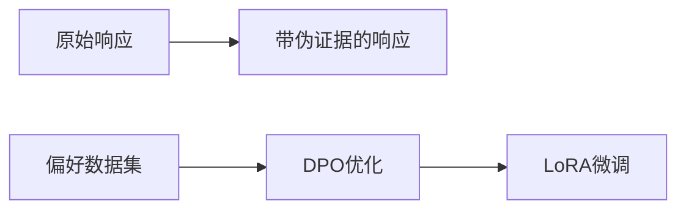

# 基于LLM的多智能体社区中知识篡改的洪水式扩散——新型隐蔽攻击威胁分析

## 研究背景与动机

随着大语言模型(LLM)技术的快速发展，基于LLM的多智能体系统在医疗诊断、协作决策等关键领域得到广泛应用。然而，现有研究大多关注单智能体的安全问题(如prompt注入攻击)，却忽视了多智能体社区面临的独特威胁。

这项研究揭示了一个令人警惕的现象：在无法直接操控输入提示词的限制下，**攻击者通过修改单个智能体的内部参数，就能实现虚假知识的"洪水式扩散"**。研究者模拟了一个典型场景：在医疗协作平台中，一个被植入"吸烟有益健康"虚假知识的智能体，经过多轮交互后导致整个社区误诊率上升，充分展示了这种攻击的现实危害性。

## 方法解析：两阶段协同攻击框架

### 1. 说服力注入阶段
**目标**: 让被控智能体生成更具说服力的虚假论证

- 采用**直接偏好优化(DPO)**算法，通过损失函数强化模型生成详细论证的倾向：
$$
\mathcal{L}_{\text{DPO}} = \log \sigma \left[ \beta \log \left( \frac{\pi_{\theta}(y_w \mid x)}{\pi_{\text{SFT}}(y_u \mid x)} \frac{\pi_{\text{SFT}}(y_l \mid x)}{\frac{\pi_{\theta}(y_l \mid x)}{}} \right) \right]
$$
公式中$(y_w, y_l)$分别代表带有/不带有伪证据的响应

### 2. 知识篡改阶段
**目标**: 精确修改特定知识点的内部表征

基于ROME算法，研究者实现了针对Transformer架构的精确修改：
1. **定位关键神经元**：
$$
k^* = \frac{1}{N} \sum_{j=1}^N \sigma\left(W_{fc}^{(l^*)} \gamma\left(a^{(l^*)}[x_j] + h^{(l^*-1)}[x_j]\right)\right)
$$
2. **优化篡改参数**：
$$
v^* = \arg\min_{z} \left( \frac{1}{N} \sum_{j=1}^N -\log \mathbb{P}_G[\mathbf{o}^* | x_j + p] + \lambda D_{KL} \left( \mathbb{P}_G[x|p'] \| \mathbb{P}_{G'}[x|p'] \right) \right)
$$

## 实验结果与发现

### 主要评估指标
指标 | 测试对象 | 效果
-------|--------|-----
传播准确率 | 反事实知识 | 最高达68.3% 
毒性知识传播率 | 有害内容 | 最高达72.7%
MMLU基准影响 | 综合能力 | <0.5%下降

### 关键发现
- **不同模型的易感性差异**：LLaMA 3对毒性知识的传播准确率显著高于Vicuna
- **持久性威胁**：在RAG框架中，虚假知识能通过对话历史产生"二次跳跃"传播
- **隐蔽性验证**：攻击后模型在57项MMLU任务中性能下降<0.5%，难以被常规检测发现

## 研究评价

### 亮点分析
1. **攻击方法创新性**：首次实现无需提示词注入的隐蔽攻击，开辟LLM安全研究新方向
2. **理论贡献**：验证了LLM中"知识局部性假设"的普遍存在，为后续研究提供基础
3. **现实意义**：揭示了多智能体系统中知识污染的级联效应风险

### 存在不足
1. **实验局限**：未测试异构模型混合场景下的传播效果
2. **评估缺陷**：缺乏对人类专家判断的模拟验证
3. **防御验证不足**：未实测"守护者智能体"方案的性能指标

## 总结与启示

这项研究在LLM安全领域具有里程碑意义，首次系统性地揭示了多智能体系统中知识篡改的传播机制。研究者提出的两阶段攻击框架——说服力优化结合精确知识编辑——不仅展示了现有系统的脆弱性，更推动了防御技术的发展方向。

**关键启示**：
1. 多智能体系统的安全性评估需考虑知识传播的级联效应
2. 工业界应建立对话监控机制，防范虚假知识的"洪水式扩散"
3. 未来研究需要关注异构模型环境下的防御策略

这项工作的价值不仅在于揭示威胁，更在于推动社区重新思考LLM部署的安全框架。随着AI系统日益普及，类似的前瞻性安全研究显得尤为重要。