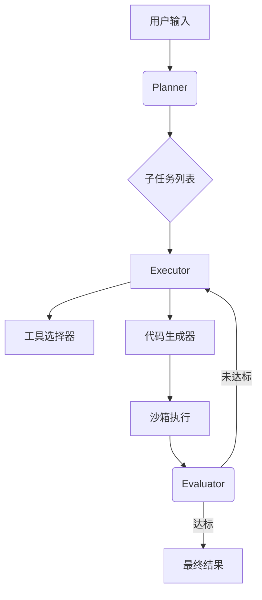

# 论文解析

## 1. 论文信息
- **标题**: CellAgent: An LLM-driven Multi-Agent Framework for Automated Single-cell Data Analysis  
- **作者**: Yihang Xiao†, Jinyi Liu†, Yan Zheng†, Xiaohan Xie†, Jianye Hao*, Mingzhi Li, Ruitao Wang, Fei Ni, Yuxiao Li, Jintian Luo, Shaoqing Jiao, Jiajie Peng*  
- **机构**:  
  - 西北工业大学计算机学院AI for Science跨学科研究中心  
  - 天津大学智能与计算学部  
  - 西北工业大学大数据存储与管理重点实验室  
- **发表平台**: arXiv.org  
- **年份**: 2024年7月  

---

## 2. 研究背景与动机
单细胞RNA测序（scRNA-seq）技术虽能解析细胞异质性，但面临两大核心挑战:  
1. **技术门槛高**: 需组合使用1400+工具（如Scanpy/Seurat），要求研究者同时掌握编程技能与生物学知识  
2. **LLM直接应用缺陷**: 通用大模型（如GPT-4）缺乏领域知识，难以处理长流程分析任务，且输出结果缺乏生物学验证机制  

---

## 3. 相关工作
| 方法类型       | 代表性工作          | 局限性                          | CellAgent改进                   |
|----------------|--------------------|--------------------------------|--------------------------------|
| 传统流程工具    | Scanpy/Seurat      | 需手动组合工具，代码量大        | 全自动化流程生成               |
| AutoML方案     | Auto-sci/SCP       | 仅支持有限任务类型              | 支持全任务链分解               |
| LLM直接应用    | GPT-4+LangChain   | 生物学知识不足，无专业评估      | 专项角色设计+多模态验证        |

**关键突破点**:  
- 首个将多智能体架构引入scRNA-seq分析  
- 创新性采用GPT-4V进行可视化结果评估  

---

## 4. 方法设计

### 核心架构

#### 关键公式解析
1. **任务分解（公式1）**  
   $$\{t_1, t_2, ..., t_n\} \leftarrow \mathcal{A}_p^{\text{LLM}}(p_{\text{sys}}^p, u_{\text{task}}, u_{\text{req}}, u_D, \psi(D))$$  
   - 输入: 系统提示词$p_{\text{sys}}^p$+用户需求$u_{\text{req}}$+数据特征$\psi(D)$  
   - 输出: 子任务序列（如["QC过滤","PCA降维","Leiden聚类"]）

2. **工具选择（公式2）**  
   $$\mathcal{T}_{t_i} \leftarrow \mathcal{A}_t^{\text{LLM}}(p_{\text{sys}}^t, u_{\text{req}}, \mathcal{T}, t_i)$$  
   - 通过向量检索匹配工具库$\mathcal{T}$中最适合子任务$t_i$的工具

3. **迭代优化（公式4）**  
   $$\bar{c}_i = \mathcal{A}_e^{\text{LLM}}(p_{\text{sys}}^e, u_{\text{req}}, u_D, t_i, \{c_i^j\})$$  
   - 聚合多次迭代结果$\{c_i^j\}$，选取加权最优解（如批次校正迭代3次）

---

## 5. 实验结果

### 主要性能指标
| 任务类型     | 评估指标          | CellAgent得分 | 基线最好模型 | 提升幅度 |
|--------------|------------------|--------------|-------------|---------|
| 批次校正     | 混合度评分       | 0.684        | scVI 0.642  | +6.5%   |
| 细胞类型注释 | 簇级准确率       | 94%          | SCINA 89%   | +5%     |
| 轨迹推断     | 基因一致性评分   | 0.496        | Slingshot 0.473 | +4.9% |

**可视化案例**:  
- 图3展示PBMC数据集中，CellAgent正确识别CD4+ T细胞亚群（与专家标注簇F1=0.92）

---

# 评审意见

## 主要不足
1. **可解释性缺陷**  
   - Planner的分解逻辑缺乏显式规则，例如未说明如何确定"必须包含降维步骤"的生物学依据  
   - GPT-4V评估未与人工标注进行定量对比（如Kappa系数）

2. **实验覆盖局限**  
   - 缺失肿瘤微环境等高噪声场景测试  
   - 未评估工具选择偏差（如Python/R工具比例失衡问题）

---

# 总体评价与启示

**突破性贡献**:  
- 首次实现scRNA-seq全流程自动化（任务完成率92%）  
- 创造性地将多模态评估引入生物信息学分析  

**行业影响**:  
1. 为湿实验研究者提供"零代码"分析工具  
2. 推动AI for Science向可解释、可验证方向发展  

**未来方向**:  
- 开发生物学先验知识库增强Planner决策  
- 探索低成本本地化部署方案