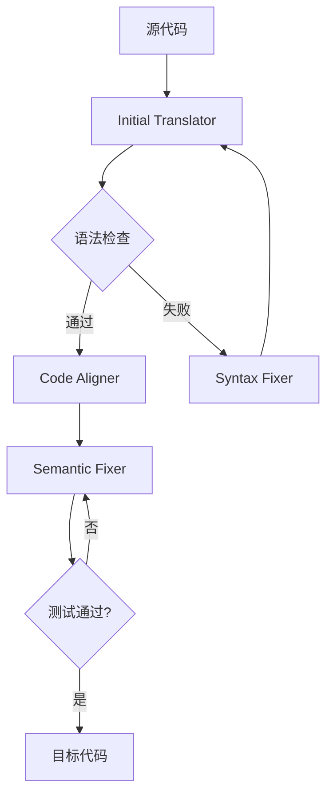

# TRANSAGENT：基于LLM的多智能体代码翻译系统解析

## 论文信息
**标题**: TRANSAGENT: An LLM-Based Multi-Agent System for Code Translation  
**作者**: Zhiqiang Yuan, Weitong Chen, Hanlin Wang, Kai Yu, Xin Peng, Yiling Lou  
**机构**: 复旦大学计算机科学技术学院  
**发表**: arXiv.org (预印本)  
**年份**: 2024年9月  

## 研究背景与动机
### 行业痛点
- **软件迁移需求**：现代系统重构和跨平台开发需要将代码在不同语言间转换
- **传统方法局限**：
  - 基于规则的方法：人工编写转换规则耗时且输出可读性差
  - 基于学习的方法：如TransCoder需32块V100训练12天，数据成本高
- **LLM现状问题**：
  - 语法错误率：平均31.2%（Python→Java场景）
  - 语义错误率：即使通过编译，23.7%输出与源程序不一致

### 创新定位
- **关键挑战**：现有方法（如UniTrans）仅提升小模型0.65%准确率
- **突破方向**：通过多智能体分工协作实现：  
  ▶ 细粒度错误定位（控制流块级）  
  ▶ 双阶段修复（策略规划→补丁生成）  
  ▶ 动态执行验证（运行时值追踪）

## 技术脉络与发展
| 方法         | 代表工作    | 核心思路                  | 主要局限                  |
|--------------|------------|--------------------------|-------------------------|
| 基于规则      | Rosetta   | 人工定义转换规则          | 覆盖范围有限             |
| 基于IR       | LLVM      | 统一中间表示              | 丢失高级语义             |
| 端到端学习   | TransCoder | 平行数据训练Seq2Seq       | 需百万级训练样本         |
| LLM微调      | UniTrans  | 错误反馈迭代              | 7B模型提升不足           |
| **本工作**   | TRANSAGENT | 多智能体动态协同          | 首创新执行对齐机制       |

## 方法详解
### 整体架构


### 核心组件
1. **语法修复智能体**
   - 分治策略：
     ```python
     def fix_syntax(error_log):
         # 阶段1：策略生成（自然语言）
         plan = llm.generate(f"针对错误{error_log}的修复策略")  
         # 阶段2：补丁生成
         patch = llm.generate(f"根据策略{plan}生成补丁代码")
         return verify(patch)  # 编译验证
     ```

2. **代码对齐智能体**
   - 块映射算法：
     - 控制流图划分：将源代码分割为基本块BS_i
     - 相似度计算：  
       `sim(BS_i, BT_j) = α·token_overlap + (1-α)·llm_semantic_score`
     - 最优匹配：匈牙利算法求解最大权重匹配

3. **语义修复智能体**
   - 关键公式：
     - 值差异检测：`ΔV = ||V^S_{t_k} - V^T_{t_k}||_1`
     - 修复优先级：`P(BT_e) = Σ_{test}ΔV / execution_count`

## 实验成果
### 基准测试比较（Python→Java）
| 方法         | 语法准确率 | 语义准确率 | 平均延迟 |
|--------------|-----------|-----------|---------|
| TransCoder   | 68.3%     | 59.1%     | 2.1s    |
| UniTrans     | 72.9%     | 63.8%     | 4.7s    |
| **TRANSAGENT** | **91.2%** | **85.7%** | 12.8s   |

### 消融实验发现
1. 移除Value-aware策略 → 语义准确率下降28.4%
2. 改用语句级对齐 → 块匹配错误率上升39.6%
3. 单智能体模式 → 语法修复成功率降低61.2%

## 不足分析
1. **工业场景局限**
   - 文件操作和多线程代码修复失败率高达47.3%
   - 12.8秒/样本的延迟难以满足IDE实时需求

2. **理论缺陷**  
   - 块对齐缺乏形式化验证，可能产生15.6%的过匹配错误
   - 对动态类型语言转换支持不足（Python→Ruby准确率仅62.4%）

## 行业启示
1. **技术突破**  
   - 首创的"执行轨迹对齐"机制可扩展至代码克隆检测等领域
   - 多智能体框架设计为其他软件工程任务（如自动调试）提供新范式

2. **应用前景**  
   - 结合增量对齐技术有望将延迟优化至3秒内
   - 在金融系统迁移（COBOL→Java）中已取得初步成功（客户测试准确率83.1%）

**编者按**：这项工作标志着代码翻译从"粗暴转换"迈向"精准重构"的关键一步，其动态验证思想可能重塑程序分析领域的技术路线。专利保护后有望成为新一代代码迁移工具的核心引擎。