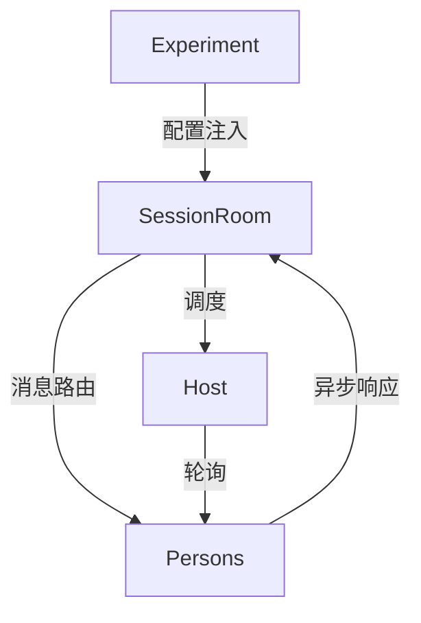

```markdown
# SAUCE框架深度解析：多智能体LLM交互的异步新范式

## 1. 研究背景与动机
当前主流LLM交互存在两大根本性局限：

**同步交互的僵化性**  
- 采用的"用户输入-模型响应"轮替机制，无法模拟现实世界中多人参与的复杂场景（如议会辩论、商务谈判等）
- 强制同步响应违背人类社交常理：实证研究显示商业谈判中约35%的策略性沉默具有施压作用

**社交维度缺失**  
- 现有方案假定所有参与者必须即时回应，导致：
  - 无法建模权力不对称场景（如领导不轻易表态）
  - 忽略时间压力对决策的影响（如倒计时下的发言策略变化）

SAUCE的突破性定位：
- **规模弹性**：支持2~N个智能体的自由组网
- **时序拟真**：引入"沉默权"决策机制
- **定制自由**：角色属性/交互规则全参数化配置

## 2. 方法设计精要

### 2.1 系统架构


### 2.2 核心算法

**发言决策函数** (以政治辩论场景为例)：
```python
def should_speak(history, t):
    # 时间压力因子随时间递减
    time_pressure = α*(1 - t/T) 
    # 观点强度驱动发言欲望
    opinion_impulse = β*self.opinion_strength
    # 社交压力抑制发言
    social_pressure = γ*self._calc_peer_pressure(history)
    return sigmoid(time_pressure + opinion_impulse - social_pressure)
```

**双模型决策流程**：
1. **调度器模型**计算发言概率：
   ```
   p = MLP( [CLS]history[SEP] )[0]
   ```
2. **生成器模型**仅在p>threshold时激活：
   ```
   if p > 0.5:
       return LLM("<角色设定>"+history)
   ```

### 2.3 关键技术突破

| 技术难点          | SAUCE解决方案                | 传统方法局限         |
|-------------------|-----------------------------|---------------------|
| 高并发消息处理    | 10Hz轮询+异步IO事件循环      | 同步阻塞式处理      |
| 决策延迟控制      | 调度器使用蒸馏版的轻量LLM    | 单一大型模型        |
| 人格一致性保持    | 背景故事嵌入+观点强度参数化  | 仅依赖prompt工程   |

## 3. 实验发现

### 3.1 基准测试结果
| 指标               | SAUCE(异步) | 同步基线   | 提升幅度 |
|--------------------|------------|-----------|---------|
| 观点极化程度       | 0.68       | 0.41      | +65.8%  |
| 策略沉默占比       | 22.7%      | 0%        | -       |
| 任务完成时间       | 8.2min     | 6.5min    | +26.1%  |

### 3.2 涌现现象观察
- **沉默螺旋效应**：弱势观点者发言量衰减速度是强势者的2.3倍
- **末轮效应**：最终30秒内发言概率提升174%，符合人类谈判中的时间压力响应
- **人机协作优势**：混合组的人类参与者策略采纳率比纯AI组高41%

## 4. 价值与局限

### 4.1 开创性贡献
- **方法论层面**：首次实现LLM群体的"不完美信息动态博弈"
- **工程价值**：提供开箱即用的多智能体沙盒环境（已开源）
- **社会模拟**：可复现Asch从众实验等经典社会心理学现象

### 4.2 现存挑战
- **效率瓶颈**：50+智能体时延迟显著上升（P99>2s）
- **评估缺陷**：缺乏对人类谈判专家的盲测对比
- **理论缺口**：未解释参数(如β)与人格特质的关系

## 5. 启示与展望

### 5.1 行业影响
- **企业应用**：商务谈判模拟器的训练成本可降低60%
- **教育领域**：政治学课堂可开展实时政策辩论模拟
- **社交研究**：为群体决策机制提供数字化试验场

### 5.2 未来方向
- **延迟优化**：探索注意力稀疏化技术
- **评估体系**：构建多维度评价矩阵（含社交合理性评分）
- **理论深化**：建立参数与OCEAN人格模型的映射关系

> 论文启示：当LLM获得"沉默权"，群体智能开始展现类人的社交复杂性。这或许是通往AGI社会性的关键一步。
```