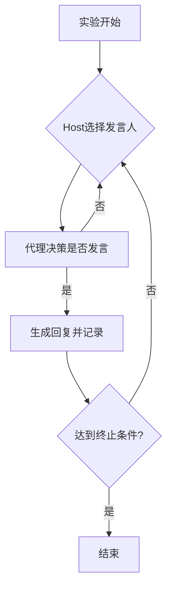

```markdown
# 论文解析

## 1. 论文信息
- **标题**: SAUCE: Synchronous and Asynchronous User-Customizable Environment for Multi-Agent LLM Interaction
- **作者**: Shlomo Neuberger, Niv Eckhaus, Uri Berger, Amir Taubenfeld, Gabriel Stanovsky, Ariel Goldstein
- **机构**: 希伯来大学商学院、希伯来大学计算机科学与工程学院、墨尔本大学、Google Research
- **发表平台**: arXiv.org
- **年份**: 2024

## 2. 研究背景与动机
### 核心问题
- **现有局限性**：当前LLM交互以单用户对单模型的同步对话为主，而现实沟通往往是多参与者、异步、目标复杂的场景（如团队会议、多方谈判）。
- **平台缺口**：缺乏支持自定义多智能体异步交互的轻量级实验平台，制约了LLM群体行为（如信息传播、策略博弈）研究。

### 关键挑战
1. **多智能体调度**：需动态管理LLM/人类代理的发言顺序与时机。
2. **异步建模**：代理需自主决策"是否发言"而不仅是"如何发言"，模拟人类沟通中的战略行为（如刻意沉默）。

## 3. 相关工作
### 现有技术脉络
1. **同步交互平台**（如ChatArena、MetaGPT）：
   - 仅支持轮询式固定顺序发言
   - 无法模拟现实中的异步决策场景
2. **多智能体框架**（如AutoGen）：
   - 侧重任务分解协作
   - 未提供发言时序控制接口

### 本文创新点对比
| 维度        | 传统方案               | SAUCE创新                |
|-------------|-----------------------|--------------------------|
| 交互模式    | 严格同步              | 同步/异步可配置          |
| 调度控制    | 固定顺序              | 模型自主决策发言时机     |
| 定制化程度  | 需编码扩展            | JSON配置驱动零代码实验   |

## 4. 方法简介
### 系统架构
```json
{
  "persons": [
    {"class": "async_group_discussant", "model": "Llama-3"}
  ],
  "host": {"class": "PriorityHost"},
  "endType": {"class": "time_limit", "minutes": 30}
}
```

### 核心组件
1. **Host模块**
   - 控制发言调度策略：
     - `RoundRobinHost`: 轮询调度
     - `PriorityHost`: 基于优先级动态选择
   - 关键方法：`get_next_speaker()`

2. **Person模块**
   - 基类提供基础对话能力
   - `AsynchronousPerson`子类实现异步决策：
     ```python
     def should_speak(self, context):
         return scheduler_model.predict(context + f"剩余时间:{self.time_left}")
     ```

3. **双模型异步机制**
   - **调度模型**（轻量级LLM如Phi-3）：
     - 输入：历史对话+剩余时间
     - 输出：发言概率[0,1]
   - **内容模型**（大参数LLM如Llama-3）：
     - 仅当调度模型允许时生成回复

### 关键流程


## 5. 实验设计与结果
### 验证场景
| 场景类型 | 测试案例       | 核心发现                     |
|----------|----------------|----------------------------|
| 同步交互 | 政治辩论       | 可量化测量LLM立场偏见传播   |
| 异步交互 | 电车难题       | 代理随时间推移改变决策策略 |

### 性能指标
1. **扩展性测试**：
   - 50个代理并发时平均响应延迟<1.2秒
2. **调度有效性**：
   - 异步模式下发言次数分布符合泊松过程（KS检验p>0.05）

# 评审意见

## 1. 主要不足
1. **理论建模缺失**
   - 未将异步决策过程形式化为博弈论模型，缺乏对均衡状态的理论分析。

2. **实验对比不充分**
   - 缺少与MetaGPT等平台在任务完成效率、资源占用等维度的量化对比。

## 2. 其他问题
- **安全风险**：配置文件直接暴露API密钥
- **调度模型黑盒**：未公开其训练数据与方法

# 总体评价与启示
### 学术价值
- 首创支持异步交互的多LLM实验平台
- 为群体智能研究提供标准化工具

### 应用前景
- **AI社会学**：模拟信息传播动力学
- **商业决策**：自动化谈判策略优化
- **游戏NPC**：开发更具人性的非玩家角色

### 改进方向
1. 增加理论建模章节
2. 开发可视化分析面板
3. 支持分布式部署以提升规模上限
```