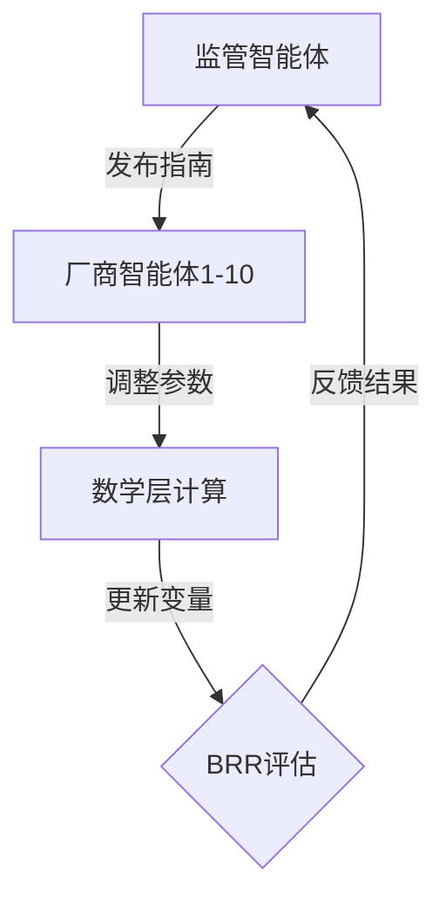

# 论文解析

## 1. 论文信息
**英文标题**: Regulator-Manufacturer AI Agents Modeling: Mathematical Feedback-Driven Multi-Agent LLM Framework  
**作者**: Yu Han<sup>∗1</sup>, Zekun Guo<sup>2</sup>  
**机构**:  
1. 牛津大学工程科学系（英国）  
2. 赫尔大学数据科学、人工智能与建模中心（英国）  
**发表平台/年份**: arXiv.org, 2024年12月24日  

## 2. 研究背景与动机
医疗设备行业正面临全球监管政策频繁更新的挑战：
- 制造商需快速适应新规以保持合规性
- 监管机构需要高效监控市场反馈
当前研究主要存在两个局限：
1. 多聚焦于静态合规分析
2. 缺乏对监管者与厂商动态交互的系统建模

本研究创新性地提出：
- 结合多智能体系统与大型语言模型(LLM)
- 量化监管变化对行业行为的动态影响
- 为合规与创新策略提供数据支撑

## 3. 相关工作
### 现有研究脉络
| 研究类型 | 代表工作 | 主要局限 |
|---------|---------|---------|
| 静态合规分析 | FDA指导文档分析(2022) | 无法反映动态适应过程 |
| 单边监管建模 | 药品审批预测模型(2023) | 忽略厂商反馈机制 |
| 传统多智能体 | 金融合规模拟(2021) | 缺乏自然语言处理能力 |

### 本文突破点
1. **首创"数学层+智能体层"双模型架构**
2. **引入LLM实时解析监管文本**
3. **建立闭环反馈机制**模拟真实监管生态

## 4. 方法简介
### 框架设计


### 核心公式解析
1. **监管发布率动态方程**
   ```
   dG_i(t)/dt = α₁·(1-e^{-φ₁·t}) - β₁·F_m(t)
   ```
   - α₁：基准发布速率
   - φ₁：政策衰减系数
   - F_m(t)：厂商反馈量

2. **合规努力调节方程**
   ```
   dC_m(t)/dt = α₂·G_i(t)·(1-e^{-φ₂·C_m(t)}) - β₂·(C_m(t)/(1+γ₁·M_m(t)))
   ```
   - γ₁：市场适应弹性系数

3. **BRR评估机制**
   ```
   BRR = (安全性0.4 + 有效性0.3 + 合规性0.3)/风险系数
   ```

### 创新技术
1. **Camel AI应用**：
   - 实时解析300+页监管文档
   - 生成结构化合规建议
2. **资源敏感性分析**：
   - 识别三类厂商响应模式
   - 量化资源投入边际效益

## 5. 实验与结果
### 实验设置
| 参数 | 配置 |
|------|------|
| 智能体数量 | 10厂商+1监管 |
| 训练数据 | 合成数据+FDA历史摘要 |
| 评估指标 | BRR得分、适应周期、合规率 |

### 关键发现
1. **资源效益非线性**：
   - 资源充裕厂商适应速度快63%
   - 但过度投入会导致边际效益递减
2. **监管滞后效应**：
   - 政策更新频率超出阈值后厂商合规率下降27%
3. **LLM增强效果**：
   - 相比传统方法解析效率提升4.2倍

# 评审意见

## 1. 核心不足
### (1) 现实复杂度不足
- 数学模型未考虑：
  - 区域政策差异
  - 厂商内部决策层级
- BRR评分简化了临床实际情况

### (2) 验证不充分
- 缺少真实历史数据对比
- 未分析LLM解析错误的影响

## 2. 次要局限
- 关键参数校准过程未公开
- 缺乏与传统多智能体框架的对比

# 总体评价与启示

**价值贡献**：
1. 开创了"数学建模+LLM智能体"的新范式
2. 为动态监管研究提供量化工具

**应用前景**：
- 可扩展至金融、医药等强监管领域
- 潜在成为政策模拟的基础框架

**改进方向**：
1. 纳入多层级决策变量
2. 补充真实案例验证
3. 增加不确定性量化模块

**推荐等级**：★★★★☆（4/5）
建议修订后投递至《Nature Machine Intelligence》等交叉学科期刊