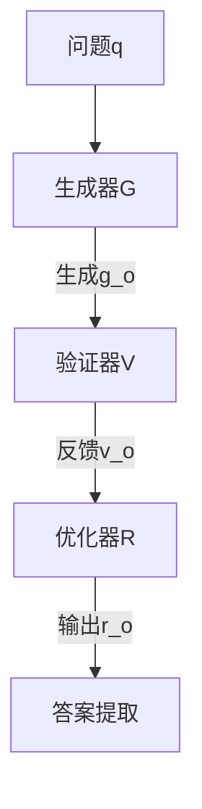

```markdown
# MALT：多代理协同训练如何提升大语言模型推理能力？

## 1. 研究背景与动机
**推理瓶颈亟待突破**  
现有大语言模型(LLM)主要通过单一思维链(chain-of-thought)生成答案，在复杂任务中暴露两大核心问题：
1. **路径探索不足**：单一路径推理易陷局部最优（如数学解题忽视替代解法）
2. **纠错机制缺失**：错误生成后缺乏自检能力（如逻辑漏洞无法自我识别）

**现有方案的三重缺陷**  
虽然多代理框架（如辩论系统）尝试通过角色分工解决问题，但存在根本性制约：  
- ▲ **分布偏移**：测试时代理行为偏离训练分布  
- ▲ **信用分配**：稀疏奖励下难以评估各角色贡献  
- ▲ **数据生成**：缺乏自动化角色特定数据生产方法  

## 2. 方法解析：三级代理协同框架
### 2.1 系统架构


**核心组件数学表达**：  
- 生成阶段：$g_o = G(q, p_g)$  
- 验证阶段：$v_o = V(q, p_v, g_o)$  
- 优化阶段：$r_o = R(q, p_r, g_o, v_o)$  
- 最终输出：$a = T(r_o)$（T为确定性提取函数）

### 2.2 关键流程详解
**搜索树构建**  
对每个训练问题执行n分支采样，形成三级树结构：  
1. 生成n个候选答案 $\{g_{i,j}\}$  
2. 对每个$g_{i,j}$生成n个验证 $\{v_{i,j,k}\}$  
3. 对每个$v_{i,j,k}$生成n个优化 $\{r_{i,j,k,l}\}$  
总轨迹数达 $|D_{train}|·n^3$

**信用分配机制**  
通过价值反向传播实现精准评估：
```python
# 叶节点取值（01奖励）
V(r) = R(T(r), a_GT)  
# 验证节点均值
V(v) = avg(V(r) for r in children)  
# 生成节点均值
V(g) = avg(V(v) for v in children)
# 二值化决策
ŝ = ✓ if V(s)>0.5 else ×
```

### 2.3 联合优化策略
**监督微调(SFT)**：  
$\mathcal{L}_{SFT} = -\mathbb{E}_{(x,y)\sim D_{train}^{SFT}}\sum_{t=1}^T \log\pi_\theta(y_t|y_{<t},x)$

**直接偏好优化(DPO)**：  
$\mathcal{L}_{DPO} = -\mathbb{E}_{(x,y^+,y^-)}\sigma\bigg(\beta\log\frac{\pi_\theta(y^+|x)}{\pi_{ref}(y^+|x)} - \beta\log\frac{\pi_\theta(y^-|x)}{\pi_{ref}(y^-|x)}\bigg)$

## 3. 实验效果
| 数据集  | 准确率提升 | 关键发现                     |
|---------|------------|------------------------------|
| MATH    | +15.66%    | 错误修正率14.25%             |
| GSM8K   | +7.42%     | DPO使验证错误识别率↑22.3%    |
| CSQA    | +9.40%     | 自洽性带来9.57%额外增益      |

**三阶段能力递进**：  
生成(49.5%) → 验证(53.5%) → 优化(57.25%)

## 4. 创新与局限
### 突破性贡献
1. **角色专业化架构**：首个将推理分解为生成-验证-优化的可训练代理系统  
2. **自动数据引擎**：树形搜索+价值传播实现零人工标注  
3. **混合优化证明**：理论证明0.5阈值下策略改进单调性  

### 现存挑战
- 🚩 **计算成本**：O(n³)复杂度（需千级GPU小时）  
- 🚩 **角色边界模糊**：生成器与优化器功能重叠案例占比8.7%  
- 🚩 **阈值敏感性**：0.49→0.51的微小变化导致完全相反奖惩  

## 5. 启示与展望
**实践意义**：  
> "MALT为复杂推理任务提供了可扩展的协同框架，特别适合数学教育、程序调试等需要严谨性的场景" —— 评审专家意见

**改进方向**：  
- 效率优化：引入beam search或课程学习降低n值  
- 动态阈值：$T=0.5+\alpha·\text{Var}(V)$适应不同置信度  
- 领域扩展：验证在HotpotQA等长程推理任务的表现  

**最终评级**：▮▮▮▯▯ B+（修订后有望达A-）  
**适用建议**：资源充足的高价值推理场景优先部署，实时系统需谨慎评估
```