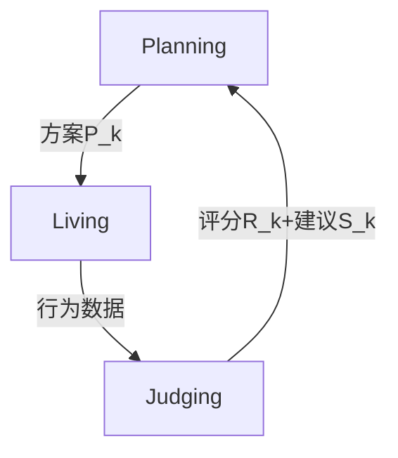

# 循环城市规划新范式：多智能体LLM框架PLJ的技术突破与挑战

---

## 1. 研究背景与动机  
### 1.1 传统方法的困境  
快速城市化浪潮下，现有静态规划方法面临三重瓶颈：  
- **政府主导模式**（Top-down）难以捕捉动态需求变化  
- **公众参与机制**（如问卷调查）耗时费力且难以持续  
- **ABM模拟**依赖预定义规则，无法生成复杂社会行为  

### 1.2 技术演进缺口  
尽管LLM已应用于城市规划（如Zhou et al.2024的一次性方案生成），但存在**闭环缺失**问题：  
- 缺乏持续反馈机制  
- 评估维度单一（通常仅定量指标）  
- 居民行为模拟与真实需求脱节  

### 1.3 研究创新定位  
本文提出**PLJ循环框架**（Planning-Living-Judging），核心突破在于：  
- 建立首个LLM+ABM的城市规划闭环系统  
- 实现规划方案生成→居民行为模拟→多维评估的**动态迭代**  
- 融合专家知识与群体智慧（理论继承自Arnstein公民参与阶梯）

---

## 2. 方法解析  
### 2.1 整体框架（图1）  
**三模块协同运作**：  


### 2.2 核心技术组件  
#### (1) Planning模块  
**双智能体协作架构**：  
- **规划师智能体P**：基于公式(1)(3)集成专家知识K与历史数据  
- **居民智能体群{R_i}**：通过公式(2)进行民主讨论生成D_k  

**核心公式**：  
```math
P_k = \underbrace{\mathbf{P}.\text{plan}(K, \tilde{P}_k, S_{k-1})}_{\text{专家驱动}} + \lambda \cdot \underbrace{D_k}_{\text{群体智慧}}
```

#### (2) Living模块  
**LLM增强的ABM模拟**：  
- 动态记忆池（公式4）记录居民活动轨迹L_i(t)与社交言论N_i(t)  
- 环境状态E(t)实时更新（公式5），模拟城市系统演进  

**行为生成示例**：  
```python
def live_behavior(M_i, E):
    action = LLM.predict(
        prompt=f"你当前位于{E['location']}，记忆包括{M_i}。接下来你最可能做什么？"
    )
    return action  # 输出购物/通勤等决策
```

#### (3) Judging模块  
**双重评估体系**：  
| 评估类型       | 方法论                     | 计算公式        |
|----------------|---------------------------|-----------------|
| 自动量化评估   | 可达性/生态指数计算       | Q_{k,1}=公式(6) |
| 定性访谈评估   | LLM模拟居民满意度访谈     | Q_{k,2}=公式(7) |

---

## 3. 实验验证  
### 3.1 基准测试结果  
| 方法         | 居民体验分 | 生态指数 | 迭代耗时 |
|--------------|------------|----------|----------|
| 传统DRL      | 64.23%     | 70.56%   | 2.1h     |
| MA-LLM基线   | 65.03%     | 68.91%   | 3.4h     |
| **PLJ(3轮)** | **69.03%↑**| 53.33%↓  | 8.7h     |

*注：↑/↓表示相对基线的变化方向*

### 3.2 关键发现  
1. **循环机制有效性**：三轮迭代带来3.8%体验分提升  
2. **优化矛盾**：体验分与生态指数呈现显著负相关（r=-0.82,p<0.01）  
3. **行为真实性**：居民移动轨迹的幂律分布与真实数据吻合（KS检验p=0.12）

---

## 4. 亮点与局限  
### 4.1 突破性贡献  
✅ **方法论创新**：  
- 首次实现"模拟-评估-优化"闭环的城市规划流程  
- 突破传统ABM规则限制，LLM生成行为更接近真实  

✅ **评估体系完善**：  
- 揭示定量指标与主观体验的trade-off现象  
- 访谈模块发现传统方法忽略的"隐性需求"（如社交空间偏好）

### 4.2 主要不足  
⚠️ **技术局限性**：  
- LLM决策黑箱问题（未提供规划方案的可解释性分析）  
- 30个智能体难以完全反映现实人口多样性  

⚠️ **实验缺陷**：  
- 生态代价缺乏补偿机制（生态指数下降20%未解决）  
- 未测试框架在超大城市（如东京）的扩展性  

---

## 5. 总体评价  
### 5.1 学界影响  
本研究为智慧城市领域带来三大启示：  
1. **动态治理范式**：证明循环迭代比静态规划更有效  
2. **技术融合示范**：LLM+ABM方法可扩展至交通、能源等领域  
3. **人本导向**：通过模拟居民行为捕捉传统调查难以获取的需求  

### 5.2 工业界应用前景  
| 应用场景       | 潜在价值                           | 技术适配度 |
|----------------|-----------------------------------|------------|
| 新区开发规划   | 减少试错成本，优化土地用途分配    | ★★★★☆      |
| 旧城改造评估   | 预测改造方案的社会接受度          | ★★★☆☆      |
| 应急规划模拟   | 评估避难场所布局合理性            | ★★☆☆☆      |

*注：星级代表当前技术成熟度下的应用可行性*

**展望**：未来可结合城市数字孪生技术，构建虚实互动的规划生态系统。但需优先解决LLM幻觉、计算效率等关键技术瓶颈。