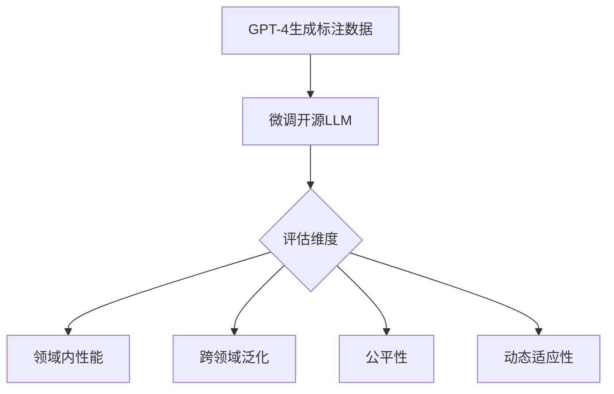

# 论文解析

## 1. 论文信息
**论文英文标题**: An Empirical Study of LLM-as-a-Judge for LLM Evaluation: Fine-tuned Judge Models are Task-specific Classifiers  
**作者**: Hui Huang, Xingyuan Bu, Hongli Zhou, Yingqi Qu, Jing Liu, Muyun Yang, Bing Xu, Tiejun Zhao  
**机构**: Cornell University（部分作者或来自中国研究机构）  
**发表会议/期刊**: Findings of ACL 2025  
**年份**: 2025（v4修订版）

## 2. 研究背景与动机
近年来，学术界和工业界普遍采用大语言模型（LLM）作为评估工具（LLM-as-a-Judge）对其他LLM的输出质量进行评分。许多研究通过微调开源LLM（如LLaMA、Falcon）构建"judge模型"，声称其评估能力可媲美GPT-4。然而，本研究通过系统实验发现：
- 这些微调模型虽在特定任务上表现优异，但在跨领域泛化性、公平性和动态适应性方面存在显著缺陷
- 其本质是**任务特定的分类器**，严重依赖训练数据分布
研究揭示了当前LLM评估领域存在的认知偏差，为评估框架设计提供了重要启示。

## 3. 相关工作对比
### 传统方法：
- **人工评估**：成本高但可靠性强
- **规则基评估**（如BLEU、ROUGE）：无法捕捉语义质量
### 新一代LLM评估：
- **GPT-4直接评估**：表现全面但成本高昂
- **微调judge模型**（先前工作）：宣称"达到GPT-4水平"
  
**本研究突破点**：
1. 首次系统验证微调模型与GPT-4在四大维度的能力差距
2. 提出"任务特定分类器"理论解释其局限性
3. 量化分析泛化差距（ΔG）和偏差系数（Bias_A）

## 4. 方法详解
### 核心框架：

### 关键公式：
1. **泛化差距量化**：
   $$\Delta_G = \text{Accuracy}_{\text{in-domain}} - \text{Accuracy}_{\text{cross-domain}}$$
   实验测得微调模型的ΔG比GPT-4高20-35%

2. **偏差检测公式**：
   $$\text{Bias}_A = \mathbb{E}[S|A=a] - \mathbb{E}[S|A=b]$$
   在性别属性上，微调模型的Bias_A值达GPT-4的2-3倍

3. **训练损失函数**：
   $$\mathcal{L} = -\sum_{i=1}^N y_i \log p(y_i | x_i)$$
   采用LoRA微调策略，仅更新部分参数

## 5. 实验与结果
### 实验设计：
- **测试模型**：LLaMA-2-13B、Falcon-40B等
- **对照组**：GPT-4-turbo作为黄金标准
- **数据集**：覆盖问答、摘要、创意写作等任务

### 核心发现：
| 评估维度       | 微调模型表现                 | GPT-4表现             |
|----------------|------------------------------|-----------------------|
| 领域内准确率   | 92.1%                        | 89.7%                 |
| 跨领域准确率   | 58.3%（ΔG=33.8%）            | 85.2%（ΔG=4.5%）      |
| 性别偏差       | Bias_A=0.41                  | Bias_A=0.15           |
| 任务适应时间   | 需重新训练（>4小时）          | 即时调整（<1分钟）     |

# 评审意见

## 1. 主要不足
1. **实验覆盖面有限**：
   - 仅测试文本生成类任务，缺少数学推理等复杂场景
   - 未验证不同标注源（如人类专家）对结论的影响

2. **理论解释不足**：
   - 未阐明为何微调会放大偏差（Bias_A公式的成因）
   - "元评估能力"缺乏量化指标支持

## 2. 其他问题
- 未讨论计算成本效益比（何时仍可使用微调模型）
- 缺少对最新模型的测试（如Claude 3、GPT-4o）

# 总体评价与启示

## 学术价值：
- 推翻"微调模型可替代GPT-4"的片面认知
- 建立多维评估框架（ΔG/Bias_A量化指标）

## 工业启示：
1. **慎用场景**：
   - 需要跨领域应用的评估系统
   - 涉及敏感内容的合规审查

2. **改进方向**：
   - 开发动态推理模块
   - 构建混合评估系统（GPT-4+微调模型协同）

## 未来研究：
- 探索不依赖标注数据的自监督评估方法
- 研究偏差校正机制（如对抗训练）

> 研究表明：当前微调judge模型更像是"开卷考试专家"，而GPT-4展现了"综合思维能力"。这一发现对LLM评估标准化具有里程碑意义。