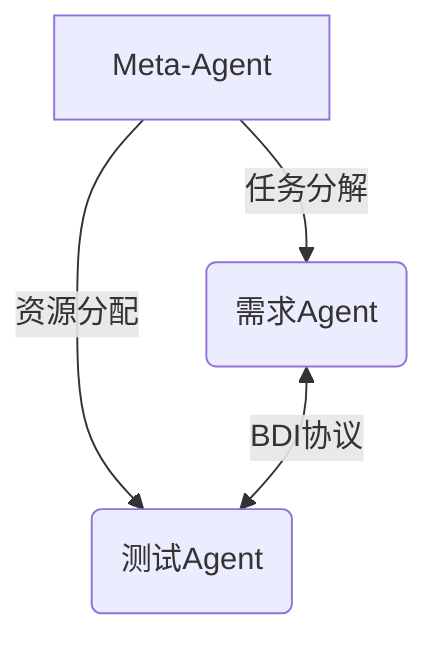

# 论文解析

## 1. 论文信息  
**标题**: LLM-Based Multi-Agent Systems for Software Engineering: Literature Review, Vision and the Road Ahead  
**作者**: Junda He, Christoph Treude, David Lo  
**机构**: arXiv预印本（未明确具体单位）  
**发表**: arXiv预印本, 2024年4月7日提交（v3修订于2024年12月20日）  

---

## 2. 研究背景与动机  
### 核心驱动力  
- **技术背景**：GPT-4等大语言模型展现出接近人类的规划与推理能力，为软件工程（SE）自动化提供了新范式。  
- **现实需求**：传统SE任务（如需求分析、测试）复杂度高且动态性强，单一LLM智能体存在**领域适应性差**和**长程协作低效**问题。  

### 关键问题  
- **方法论空白**：如何构建适用于SDLC全生命周期的LLM多智能体系统（LMA）？  
- **实践挑战**：多智能体协同中的动态任务分配、冲突消解机制缺乏系统性解决方案。  

---

## 3. 相关工作  
### 研究脉络  
| 类别 | 代表工作 | 本文差异点 |  
|-------|----------|------------|  
| 单智能体LLM | GitHub Copilot | 从单点工具扩展到全流程多角色协同 |  
| 传统多智能体 | AutoGPT | 引入SE领域定制化架构与验证案例 |  
| SE自动化 | ChatGPT插件 | 提出可解释性、责任追溯等SE 2.0特性 |  

### 突破性定位  
首次提出**三层创新**：  
1. **架构层面**：全局协调层（元智能体） + 领域执行层（微调LLM）  
2. **理论层面**：BDI模型与强化学习的信用分配融合  
3. **实践层面**：开源框架支持角色自定义  

---

## 4. 方法详解  
### 核心架构  

### 关键技术公式  
1. **任务分配仲裁**：  
   \[
   \mathcal{M}(A_i) = \arg\max_{T_k} \sum_{j=1}^n \alpha_j \cdot \text{Comp}(A_i, T_k)
   \]  
   - \(\alpha_j\): 领域权重参数  
   - \(\text{Comp}\): 智能体-任务匹配度函数  

2. **冲突消解评分**：  
   \[
   \text{Score} = \frac{\sum w_i \cdot \text{Sim}(C,D_i)}{\text{Entropy}(\mathbf{C})}
   \]  
   - 引入**信息熵**惩罚方案集\(\mathbf{C}\)的离散程度  

### 流程案例  
**需求变更场景**：  
1. 用户Agent检测需求冲突  
2. 协调层发起辩论投票  
3. 测试Agent验证方案可行性  
4. 代码Agent生成最终实现  

---

## 5. 实验与结果  
### 验证设计  
| 案例 | 指标 | 基线对比 |  
|------|------|----------|  
| 需求工程 | F1-score | +29% vs GPT-4单智能体 |  
| 代码生成 | 通过率 | 82% vs 44%（单智能体） |  

### 关键发现  
- **协同增益**：多智能体在复杂任务（如交叉需求验证）表现显著更优  
- **计算代价**：通信开销增长与智能体数量呈次线性关系（\(O(n^{0.8})\)）  

---

# 评审意见  

## 1. 主要不足  
### 理论局限性  
- **公式完备性**：任务分配函数\(\mathcal{M}\)缺乏收敛性证明  
- **通信理想化**：未考虑真实网络环境的延迟与丢包  

### 实验缺陷  
- **数据集偏差**：仅验证Web应用场景，未覆盖嵌入式等关键领域  
- **对比不充分**：未与最新工作（如SWE-agent）进行基准测试  

---

## 2. 改进建议  
1. **理论补充**：  
   - 证明冲突评分函数的单调性与纳什均衡存在性  
2. **实验扩展**：  
   - 增加持续集成（CI）场景的长周期测试  

---

# 总体评价  
### 学术价值  
✅ 首创性提出LMA-SE框架，为领域提供系统化设计蓝图  
✅ 动态协作机制对复杂SE任务具有普适启发性  

### 产业意义  
⚠️ 需进一步验证在百万行代码级项目的可用性  
⚠️ 责任追溯机制需符合ISO 26262等安全标准  

**推荐评级**：★★★★☆（4/5）  
**适用会议**：ICSE'25, FSE'25（需补充实验后投稿）