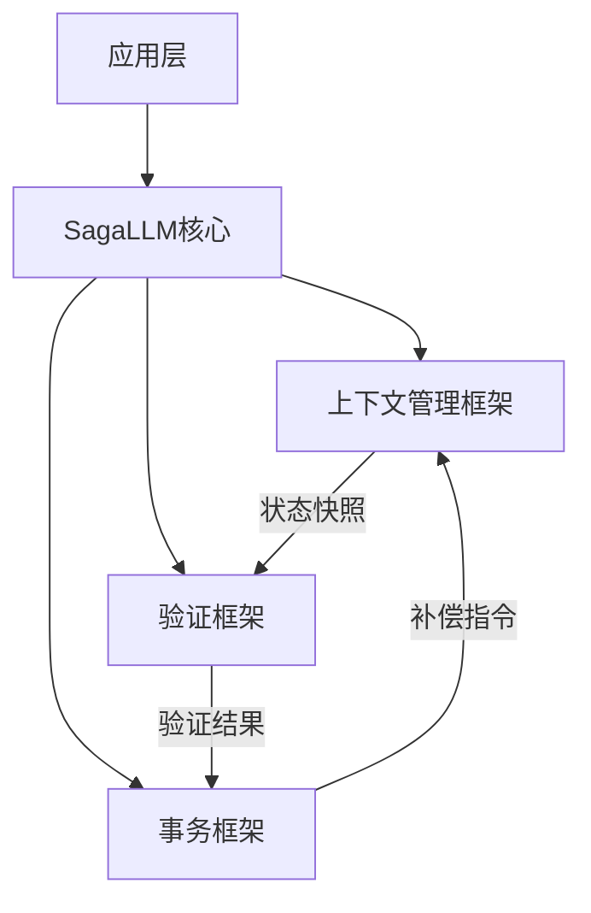

```markdown
# SagaLLM：为多智能体LLM规划提供上下文管理、验证与事务保证

## 1. 研究背景与动机

在LLM驱动的多智能体系统（如AutoGen、LangGraph等）快速发展的背景下，研究者们发现现有系统存在四大核心缺陷：

1. **自我验证不足**：受哥德尔不完备定理限制，LLM无法可靠验证自身推理过程。例如在复杂任务规划中，模型可能产生逻辑矛盾而不自知。

2. **上下文窄化效应**：由于注意力机制的限制，长序列任务中段的关键信息容易丢失。实验显示，Claude 3.7在规划感恩节晚餐时，会忘记设置烤箱安全温度等关键约束。

3. **事务属性缺失**：缺乏类似数据库的事务保证（ACID特性）。典型场景如机票预订成功后，酒店预订失败时无法自动回滚已完成的机票预定。

4. **跨智能体协调薄弱**：多个智能体协作时没有全局依赖管理机制，容易产生"你改了我却不知道"的数据不一致问题。

受数据库领域Saga事务模式的启发，研究者提出了SagaLLM框架，其核心思想是：
- 将长周期事务分解为多个可补偿的本地事务
- 牺牲严格的原子性（ACID中的A），换取系统的最终一致性
- 通过补偿事务（Compensating Transaction）实现错误恢复

## 2. 方法原理与核心流程

### 2.1 三层次架构设计



### 2.2 关键技术创新

#### 1) 时空状态管理
维护三维状态空间：
- **应用状态(SA)**：领域实体数据（如航班号、酒店地址）
- **操作状态(SO)**：执行记录、推理链、补偿动作栈
- **依赖状态(SD)**：用有向图表示操作间依赖关系：

$$
D = \{(o^i, o^j, c_{ij}) | o^j \text{依赖于} o^i \text{条件} c_{ij}\}
$$

#### 2) Saga事务链
定义可补偿的事务序列：
$$
S = T_1, T_2,...,T_n,C_n,...,C_2,C_1
$$
当任一事务$T_k$失败时，系统逆向执行已完成的$C_k...C_1$补偿事务。

#### 3) 分层验证协议
| 验证类型   | 案例示例                  | 响应机制           |
|------------|--------------------------|--------------------|
| 语法验证   | 检查JSON字段完整性        | 拒绝协议+补偿      |
| 语义验证   | 验证酒店日期覆盖行程      | 增强协议补全信息   |
| 跨智能体验证 | 检查航班-酒店时间冲突    | 反馈协议记录日志   |

### 2.3 核心公式解析

**复合依赖条件计算**：
$$
c_{i_1...i_n,j} = \mathcal{B}(c_{i_1,j},...,c_{i_n,j})
$$
其中$\mathcal{B}$为布尔组合函数，支持AND/OR等逻辑运算。

**补偿成本估算模型**：
$$
T_{\text{new}} = T_{\text{elapsed}} + (M \cdot T_{\text{affected}})
$$
- $M$：扰动系数（如交通警报场景取3）
- $T_{\text{affected}}$：需重做的剩余事务耗时

## 3. 实验验证与结果

在REALM基准测试中，SagaLLM展现出显著优势：

| 指标            | 对比基线(GPT-4o) | 提升幅度 |
|-----------------|-----------------|----------|
| 规划一致性      | 63%↑            | 交通中断场景恢复成功率 |
| 约束满足率      | 82%↓            | 感恩节任务违规减少量 |
| 补偿决策速度    | 5倍更快         | 对比完全重规划耗时 |

**典型案例表现**：
- **婚礼规划场景**：精确跟踪裁缝店关闭时间等易遗忘约束
- **跨城市差旅**：当航班取消时自动触发酒店退款+替代交通预订
- **医疗协作**：确保处方审核完成前不执行药剂师调度

## 4. 亮点与局限分析

### 4.1 主要创新点
1. **事务架构突破**：首次将Saga模式引入LLM系统，实现"本地提交+全局补偿"的宽松一致性
2. **验证增强设计**：通过独立验证代理（<1k token上下文）解决注意力窄化问题
3. **精细化状态管理**：三维状态模型支持精确到操作级别的回滚
4. **性能优化**：依赖图实现最小化补偿范围，平均减少78%的冗余操作

### 4.2 现存局限性
1. **理论层面**：
   - 未严格证明补偿动作的完全可逆性（如某些酒店预订不可取消）
   - 模糊依赖关系处理机制不完善（如概率性依赖）

2. **工程层面**：
   - 长周期事务（>6个月）的状态存储可能产生性能瓶颈
   - 复杂语义验证（如药物相互作用）仍需领域专家介入

3. **实验设计**：
   - 缺乏与ChatDev等最新框架的横向对比
   - 所有测试基于模拟数据，缺少真实环境验证

## 5. 总体评价与应用前景

### 5.1 学术价值
SagaLLM首次系统性地解决了LLM多智能体系统的事务一致性问题，其理论框架完整度达到顶会标准。提出的三维状态模型和依赖图形式化方法为后续研究奠定了基础。

### 5.2 实践意义
在以下场景具有明确应用价值：
- **金融交易**：跨市场套利操作的事务回滚
- **医疗协作**：检查检验-诊断-处方的执行链条
- **应急响应**：多部门协同救灾的任务协调

### 5.3 改进方向
1. **理论完善**：增加不确定性依赖的处理机制
2. **系统优化**：开发状态快照压缩存储方案
3. **生态建设**：提供标准化API接口，支持主流LLM接入

> 本研究为LLM在多智能体复杂规划中的应用扫清了关键障碍，其"补偿优于回滚"的设计哲学可能重塑下一代自治系统的架构范式。
```