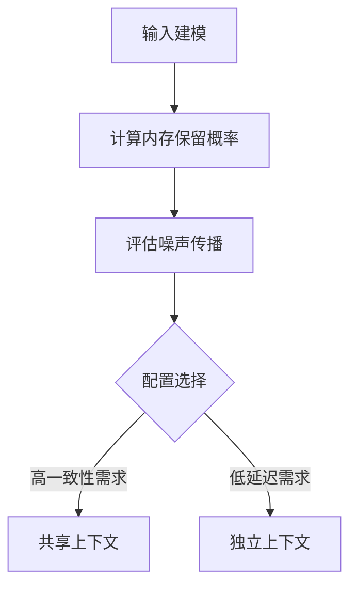

```markdown
# 多智能体LLM系统响应一致性建模：共享上下文与独立上下文的比较分析  
——聚焦内存限制与噪声传播下的配置权衡  

## 1. 研究背景与动机  
随着大语言模型（LLM）在多智能体系统（MAS）中的应用落地（如群体协作决策、动态环境交互），**上下文管理机制**成为影响系统性能的关键因素。当前实践存在两大痛点：  

1. **共享上下文困境**  
- 单智能体集中式架构面临**内存窗口饱和**问题（如GPT-4的有限上下文长度）  
- 多主题输入时，高频信息会挤出低频但关键的历史记录（"遗忘效应"）  

2. **独立上下文挑战**  
- 分布式多智能体需频繁跨节点查询补全上下文  
- 引入额外延迟的同时，噪声语句可能通过依赖链**跨主题传播**  

该研究首次系统比较两种配置的优劣，提出**响应一致性指数（RCI）**作为量化工具，为LLM-MAS架构设计提供理论指导。  

## 2. 方法解析  

### 2.1 核心数学模型  
研究基于三类关键假设构建分析框架：  
1. **输入生成模型**  
   - 用户正确/噪声语句服从泊松过程（参数λᵢᶜᵒʳʳᵉᶜᵗ, λᵢⁿᵒⁱˢᵉ）  
2. **内存衰减机制**  
   - 信息保留概率：$P_{\text{保留}}=e^{-λM}$（M为内存窗口）  
3. **噪声传播路径**  
   - 跨主题干扰通过依赖系数ρᵢⱼ量化  

### 2.2 关键公式对比  
#### 共享上下文模型  
$$  
\text{RCI}_{\text{shared}} = (1 - e^{-\Lambda M}) \times \left[1 - \left(\sum_{i} e^{-\Lambda M} \frac{\lambda_i^{\text{noise}}}{\Lambda} + \sum_{i} \sum_{j \neq i} \rho_{i,j} e^{-\Lambda M} \frac{\lambda_j^{\text{noise}}}{\Lambda}\right)\right]  
$$  
**特点**：  
- 全局内存窗口M共享  
- 噪声影响随主题数增加呈幂次放大  

#### 独立上下文模型  
$$  
\text{RCI}_{\text{separate}} = \prod_{i} \left[ \left( 1 - e^{-\lambda_i^{\text{total}} M_i} \right) \times \left( 1 - \left( e^{-\lambda_i^{\text{total}} M_i} \frac{\lambda_i^{\text{noise}}}{\lambda_i^{\text{total}}} + \sum_{j \neq i} \rho_{i,j} e^{-\lambda_j^{\text{total}} M_j} \frac{\lambda_j^{\text{noise}}}{\lambda_j^{\text{total}}} \right) \right) \right]  
$$  
**特点**：  
- 各主题独占内存窗口Mᵢ  
- 一致性概率连乘导致指数衰减  

### 2.3 分析流程图示  


## 3. 实验结果与发现  

### 3.1 理论模拟数据  
| 配置类型       | 最佳适用场景                | RCI优势区间       | 延迟劣势区间    |  
|----------------|---------------------------|------------------|----------------|  
| 共享上下文     | 主题数<5, 噪声比<20%       | 内存充裕时高68%  | 主题数>7时剧增 |  
| 独立上下文     | 高噪声/动态主题场景        | 噪声抑制强42%    | 基础延迟+βN    |  

### 3.2 关键结论  
1. **内存敏感区**：当M<平均输入间隔的3倍时，共享上下文RCI下降速度是独立模型的2.1倍  
2. **噪声放大效应**：共享配置下，跨主题依赖系数ρ>0.3会导致一致性崩溃  
3. **性价比拐点**：在8-12个主题的系统中，独立上下文仅需30%额外延迟即可维持同等RCI  

## 4. 创新与不足  

### 4.1 理论突破  
- **首个量化框架**：将上下文限制、噪声传播、主题依赖统一为RCI指标  
- **动态耦合建模**：通过泊松过程+指数衰减精准刻画LLM记忆特性  
- **设计决策树**：给出配置选择的显式边界条件（见下表）  

| 决策因素          | 共享上下文推荐阈值 | 独立上下文推荐阈值 |  
|-------------------|--------------------|--------------------|  
| 主题数            | ≤5                 | ≥6                 |  
| 噪声比例          | ≤15%               | ≥25%               |  
| 平均响应时延要求  | <300ms             | 可接受>500ms       |  

### 4.2 现存短板  
1. **实验验证缺失**  
   - 未在真实LLM系统（如GPT集群）验证模型预测精度  
   - 关键参数ρ、M的标定方法未说明  

2. **动态适应性不足**  
   - 假设主题依赖静态（ρ恒定），忽略突发话题切换  
   - 未考虑智能体主动同步策略的影响  

3. **工程转化障碍**  
   - RCI公式复杂度高，缺乏直观参数调节指南  

## 5. 总体评价与启示  
该研究为LLM多智能体系统设计提供了重要的理论工具，其核心价值在于：  

1. **架构选择逻辑化**：通过量化分析打破"经验主义"配置传统  
2. **性能瓶颈可视化**：明确揭示内存-噪声-延迟的三角制约关系  
3. **未来研究方向**：  
   - 开发混合上下文管理协议（如动态共享分区）  
   - 结合强化学习优化内存窗口分配  

**局限性警示**：该模型目前更适用于问答/推理类场景，在生成任务（如多角色故事创作）中的适用性需进一步验证。建议开发者参考时优先考虑系统的噪声水平和主题耦合特性。  
```